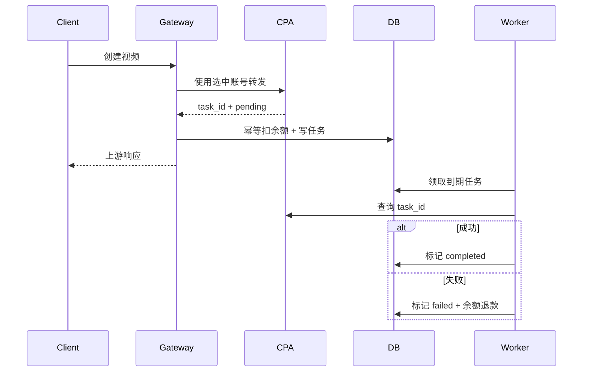

# 技术设计: 独立视频平台与失败退款

## 技术方案

### 核心技术
- Go/Gin/Ent/PostgreSQL/Redis 与现有 Vue 3 管理端。
- 复用 OpenAI 媒体调度、用量计算、模型映射和粘性会话。

### 实现要点
- 增加 `PlatformVideo`，路由只允许视频端点。
- API Key 账号按 `Authorization: Bearer` 透传到配置的 cpa-fan Base URL。
- `video_billing_mode=per_second` 使用价格乘时长；`per_request` 使用一次价格。
- 计费幂等事务同时写入 `video_tasks`，避免已扣费却没有跟踪记录。
- 后台领取到期任务并查询原账号；失败事务锁定任务、退款并把用量实际费用归零。

## 架构设计



## 架构决策 ADR

### ADR-VIDEO-001: 视频任务持久化与余额补偿
**上下文:** 视频上游异步返回终态，进程可能在任务完成前重启。
**决策:** 使用数据库任务表和后台轮询；创建时立即扣余额，失败时执行幂等补偿。
**理由:** 用户选择即时扣费方案，且明确不存在订阅退款需求。
**替代方案:** 冻结余额后结算 → 拒绝原因: 用户选择方案 2。
**影响:** 增加一张任务表、一个后台运行器和余额退款事务。

## API设计
- `POST /v1/videos`
- `POST /v1/video/create`
- `POST /v1/videos/generations`
- `POST /v1/videos/edits`
- `POST /v1/videos/extensions`
- `GET /v1/videos/:video_id`
- `GET /v1/video/query?id=:video_id`

## 数据模型
```sql
ALTER TABLE groups ADD COLUMN video_billing_mode VARCHAR(20) NOT NULL DEFAULT 'per_second';
CREATE TABLE video_tasks (... upstream_task_id, billing_request_id, refund_amount, status, next_poll_at, refunded_at ...);
```

## 安全与性能
- Base URL 继续使用现有上游 URL 校验与代理机制，API Key 只存账号凭证。
- 任务表不保存提示词或 API Key。
- `FOR UPDATE SKIP LOCKED`/租约避免多实例重复查询，退款事务再次校验终态。

## 测试与部署
- 后端覆盖接口映射、按次/按秒、任务原子创建、重复失败退款一次。
- 前端覆盖平台类型、价格模式与模型同步。
- 部署前备份 PostgreSQL，构建镜像后执行迁移并检查容器健康。
