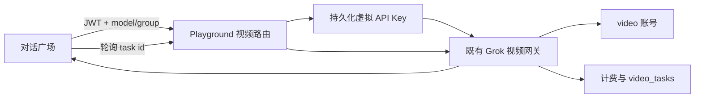

# 技术设计: 对话广场视频生成

## 技术方案
### 核心技术
- Go / Gin 现有 Playground 与 OpenAI Gateway 处理器。
- Vue 3 / Axios 现有消息状态和会话持久化。
- 浏览器原生 `<video controls>`。

### 实现要点
- 扩展 Playground 上下文中间件，使 GET 状态请求从 query 获取 group，仍注入同一个持久化虚拟 API Key。
- Playground 视频路由直接调用现有 `GrokVideoGeneration` 与 `GrokVideoStatus`，不复制调度、计费或退款逻辑。
- 创建请求执行余额资格检查；状态查询属于已扣费任务，只保留用户和分组权限校验，避免余额恰好扣至零后无法取得结果。
- 前端按当前分组的 platform 是否为 `video` 分流；创建后每 2 秒查询一次，最长等待 10 分钟。
- 参考图使用 cpa-fan 已支持的 `input_reference.image_url` JSON 字段。

## 架构设计

## 架构决策 ADR
### ADR-20260711-PLAYGROUND-VIDEO: 复用视频网关而非新建 Playground 视频服务
**上下文:** Playground 使用 JWT，而视频网关使用 API Key，但现有 Playground 中间件已经能生成持久化虚拟 Key。
**决策:** 仅增加 Playground 路由适配层并复用原处理器。
**理由:** 保证账号选择、价格、用量记录、任务持久化和失败退款只有一个实现。
**替代方案:** 前端创建真实 API Key 后直调 `/v1/videos` → 拒绝原因: 暴露密钥且增加用户操作。
**影响:** GET 状态查询需携带 group query，以恢复虚拟 Key 的分组上下文。

## API设计
### POST /api/v1/playground/videos
- **请求:** `{ model, group, prompt, input_reference?: { image_url } }`
- **响应:** 透传现有视频创建响应。

### GET /api/v1/playground/videos/:request_id?group=:group
- **请求:** 路径任务 ID 与用户可用分组名。
- **响应:** 透传现有视频状态响应。

## 安全与性能
- **安全:** JWT 鉴权、分组归属与后台模式校验复用现有 Playground 中间件；创建时检查余额，查询时不重复检查；不向浏览器暴露上游 Key。
- **性能:** 2 秒轮询；组件卸载后沿用现有模块级状态，用户停止时 AbortController 取消请求。

## 测试与部署
- **测试:** 后端路由注册、GET query/零余额边界、cpa-fan 请求解析、CSP、前端完整状态机、输入与播放器测试、类型检查和生产构建。
- **部署:** 本轮只开发、提交；按用户后续指令再部署。
