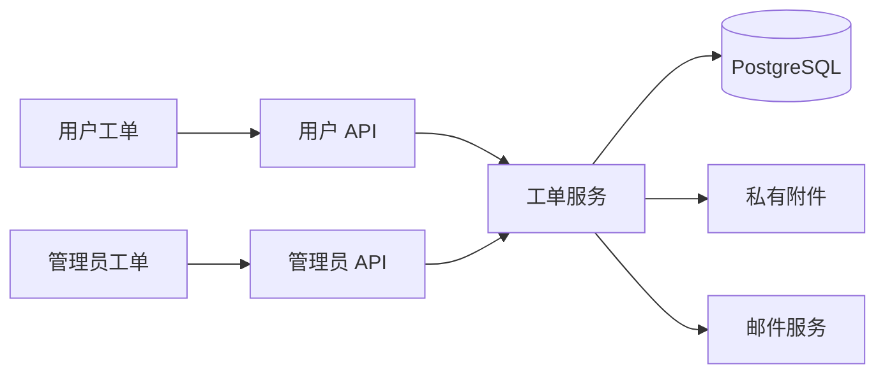

# 技术设计: 站内工单系统

## 技术方案
### 核心技术
- Go/Gin/Ent/PostgreSQL
- Vue 3/Pinia/TypeScript

### 实现要点
- 工单、消息、附件和个人已读游标分表存储。
- 事务内锁定用户或工单行，保证创建限流和状态流转原子性。
- 附件使用随机存储键和私有目录，经鉴权 API 读取。
- 邮件使用工单 ID 和消息 ID 组成幂等键，失败只记录日志。

## 架构设计

## 架构决策 ADR
### ADR-004: 在现有单体内建立工单模块
**上下文:** 需要双向对话、鉴权附件和管理员协作。
**决策:** 复用现有账号、权限、SMTP 和持久化卷，不引入外部工单 SaaS。
**理由:** 权限边界直接，无需同步用户与敏感附件。
**替代方案:** 外部 SaaS 或单次反馈表单 → 拒绝原因: 增加外部数据面或无法持续对话。
**影响:** 新增四张表、私有文件目录和定时清理任务。

## API 设计
- 用户 API: `/api/v1/tickets*`、`GET /api/v1/ticket-attachments/:id`。
- 管理员 API: `/api/v1/admin/tickets*`、`DELETE /api/v1/admin/ticket-attachments/:id`。

## 安全与性能
- **安全:** 所有查询按用户或管理员权限隔离；附件校验扩展名、MIME、实际内容与路径。
- **性能:** 列表分页并建立状态、优先级、负责人和最后消息时间索引。

## 测试与部署
- **测试:** Go 单元/集成测试、Vue 专项测试、TypeScript、ESLint 和生产构建。
- **部署:** 先备份 PostgreSQL 与 `/app/data`，再执行 migration、更新服务并验收 SMTP 与附件目录权限。
