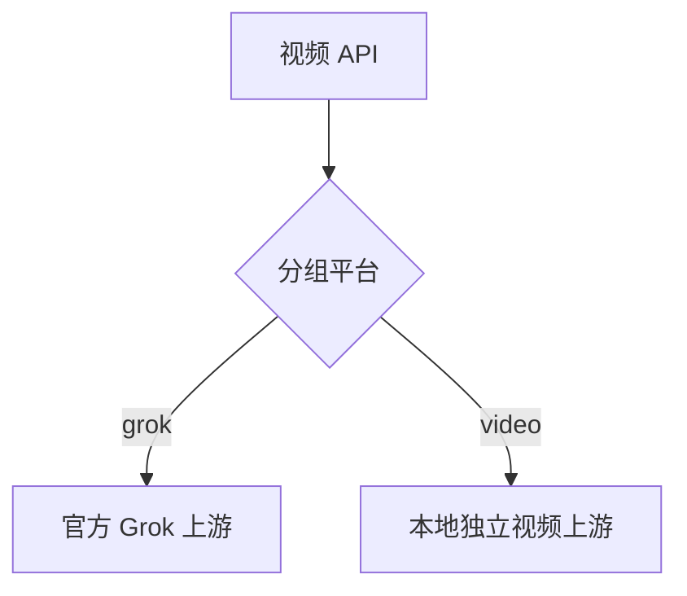

# 技术设计: 合并官方 v0.1.153

## 技术方案

### 核心技术
- Git 三方合并
- Go / Gin / Ent / Wire
- Vue 3 / TypeScript / Vitest

### 实现要点
- 以官方稳定标签 `v0.1.153` 为合并目标，不追随尚未发布的 `main`。
- 冲突按平台条件合并，不重构现有媒体服务。
- `PlatformGrok` 采用官方逻辑，`PlatformVideo` 保留本地账号、路由、计费和任务逻辑。
- 前端账号表单同时保留 Grok 与 Video 的默认值、提示和测试。

## 架构设计

## 架构决策 ADR

### ADR-20260714-UPSTREAM-MERGE: 按平台保留双路由
**上下文:** 官方 Grok 视频能力与本地独立 Video 平台复用相同 API 路径和媒体服务。
**决策:** 共享实现按 `group.platform` 和 `account.platform` 分流，同时保留两种平台。
**理由:** 两者业务边界独立，仅代码落点重合，无需复制完整媒体服务。
**替代方案:** 仅选择 ours 或 theirs → 拒绝原因: 会丢失官方 Grok 能力或本地 Video 能力。
**影响:** 共享路由必须覆盖两种平台的生成、编辑、延长和查询测试。

## API设计
- API 路径保持不变，仅根据分组平台选择上游。

## 数据模型
- 不新增合并专用数据结构；保留两侧已有迁移和 Schema。

## 安全与性能
- **安全:** 不改鉴权和分组校验；不连接生产服务；检查合并内容中是否含敏感信息。
- **性能:** 仅增加常量级平台分支，不引入额外依赖或网络调用。

## 测试与部署
- **测试:** Go 媒体路由与账号测试、Wire/Ent 生成一致性、前端账号组件测试和类型检查。
- **部署:** 本次只完成本地分支合并，不推送、不部署。
