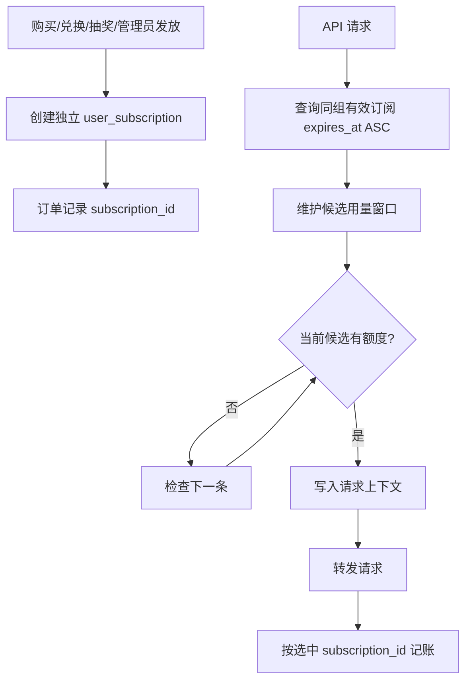

# 技术设计: 多订阅独立消费

## 技术方案

### 核心技术
- PostgreSQL 部分复合索引和外键关联。
- Ent schema 与生成代码。
- Go Service/Repository 显式候选选择。
- 现有 `usage_logs.subscription_id` 与用量幂等写入链路。

### 实现要点
- 新增 `IssueSubscription` 作为非幂等权益发放原语，每次调用创建一条全新的 `user_subscriptions` 记录。
- 注册、首次绑定等默认权益继续使用现有幂等分配入口；支付订单、正数订阅兑换码、抽奖订阅奖品和管理员主动发放改用独立发放入口。
- Repository 新增按用户、分组查询有效订阅列表的方法，固定 `expires_at ASC, id ASC`，避免任何 `Only()` 查询依赖单行假设。
- Service 遍历候选记录，先完成必要窗口维护，再跳过额度已满记录；无候选与全部耗尽分别保留 403/429 语义。
- `BillingCacheService` 对订阅模式直接校验已选中的订阅快照，不再用 `(user_id, group_id)` 聚合缓存替代它；余额、RPM 和 API Key 限流缓存保持不变。
- 后付费仍将整次请求写入鉴权阶段选中的 `subscription_id`。一次请求不跨卡拆分，下一请求才切换。
- 支付履约在事务内创建订阅并回写 `payment_orders.subscription_id`；退款优先使用该 ID，历史空值订单走显式兼容分支。
- 用户列表保持现有 DTO，并允许同组多行；订阅购买卡片对已有同组权益显示“再次购买”而不是“续费”。

## 架构设计


## 架构决策 ADR

### ADR-20260718-MULTI-SUB-001: 独立权益记录并由数据库选择候选
**上下文:** 当前按用户分组唯一记录和聚合缓存无法表达多张独立订阅。
**决策:** 每次权益发放创建独立记录，按复合索引查询最早到期候选；订阅资格以具体记录为准。
**理由:** 复用现有按 `subscription_id` 记账能力，数据模型与用户购买事实一致，改动比重构 Redis 候选队列更小。
**替代方案:** Redis 维护每个用户分组的订阅优先队列 → 拒绝原因: 需要处理窗口重置、用量回写、跨实例失效和支付事务，当前没有性能数据证明必要。
**影响:** 每次订阅请求增加一次有索引的候选查询；换取明确一致性和简单故障恢复。

### ADR-20260718-MULTI-SUB-002: 每张订阅获得后立即计时
**上下文:** 用户明确要求每张订阅按获得时间独立计算有效期，并优先使用剩余时间最少的记录。
**决策:** 所有新订阅创建时立即设置 `starts_at` 和 `expires_at`，不引入 pending/延迟激活状态。
**理由:** 与需求一致，无需额外状态机或激活竞争控制。
**替代方案:** 前一张耗尽后激活下一张 → 拒绝原因: 改变有效期含义，也无法按实际剩余时间排序。
**影响:** 同时获得的多张订阅会并行倒计时，前端需要逐条展示。

### ADR-20260718-MULTI-SUB-003: 支付订单关联精确权益
**上下文:** 多条同组订阅后，退款不能再通过用户和分组推断目标记录。
**决策:** `payment_orders` 增加可空 `subscription_id`，新订单履约时事务性写入；退款只操作关联记录。
**理由:** 避免误扣其他购买或奖品权益，并保留审计能力。
**替代方案:** 从订阅备注解析订单号 → 拒绝原因: 字符串不是稳定外键，无法可靠约束或级联检查。
**影响:** 需要兼容迁移前 `subscription_id IS NULL` 的历史订单。

## API设计

### GET /api/v1/subscriptions
- **请求:** 不变。
- **响应:** DTO 不变；同一 `group_id` 可出现多条订阅，并按到期时间升序返回有效记录。

### GET /api/v1/subscriptions/active
- **请求:** 不变。
- **响应:** DTO 不变；返回所有有效独立订阅。

### 支付订单响应
- **响应:** 可增加 `subscription_id` 可选字段；历史订单可能为空。

## 数据模型
```sql
ALTER TABLE payment_orders
    ADD COLUMN IF NOT EXISTS subscription_id BIGINT;

DROP INDEX CONCURRENTLY IF EXISTS user_subscriptions_user_group_unique_active;

CREATE INDEX IF NOT EXISTS idx_user_subscriptions_candidate_order
    ON user_subscriptions (user_id, group_id, status, expires_at, id)
    WHERE deleted_at IS NULL;

CREATE INDEX CONCURRENTLY IF NOT EXISTS idx_payment_orders_subscription_id
    ON payment_orders(subscription_id)
    WHERE subscription_id IS NOT NULL;
```

- 不拆分现有合并订阅；迁移后它作为一条 legacy 权益继续使用。
- 字段和外键由 `183_add_payment_order_subscription_link.sql` 添加，在线索引由 `184_multi_subscription_candidate_indexes_notx.sql` 创建。
- 新支付订单必须在履约事务内写入 `subscription_id`。
- 不为 `subscription_id` 增加全局唯一约束，以兼容历史修复和审计操作；业务层保证一个订单只发放一次。

## 安全与性能
- **安全:** 订阅查询始终包含当前用户 ID、分组 ID、未删除、active 和未过期条件；用户接口不得按任意订阅 ID 越权读取或操作。
- **账务:** 支付回调依赖订单审计和事务保证幂等；退款只修改订单关联权益。
- **一致性:** 选卡与后付费通过同一请求上下文传递具体订阅 ID；不允许后付费阶段重新选择另一张卡。
- **性能:** 使用候选复合索引；首版允许遍历用户同组的少量有效记录。`ponytail:` 若生产指标显示候选查询成为瓶颈，再增加按订阅 ID 的短期候选缓存。
- **部署:** 数据库迁移属于权益模型变更，上线前备份；先迁移数据库，再滚动部署后端，最后发布前端。

## 测试与部署
- **单元测试:** 独立发放不修改旧订阅；候选按到期时间选择；额度耗尽切换；窗口重置后重新参与；1 日卡不重置。
- **集成测试:** 同组多行可创建并排序；精确 `subscription_id` 用量累加；唯一索引已移除；支付履约重试只创建一次。
- **支付测试:** 新订单退款只调整关联订阅；退款失败回滚同一记录；历史空关联订单返回受控警告或强制确认。
- **前端测试:** 同组多卡逐条显示，购买按钮文案正确，类型检查与构建通过。
- **回归测试:** API Key 创建、主鉴权与 Google 鉴权、兑换码、抽奖、管理员发放、订阅列表和缓存失效。
- **部署验证:** 执行 migration 回归测试、受影响 Go 包测试、前端 Vitest/类型检查/构建，并检查数据库候选查询计划命中复合索引。
