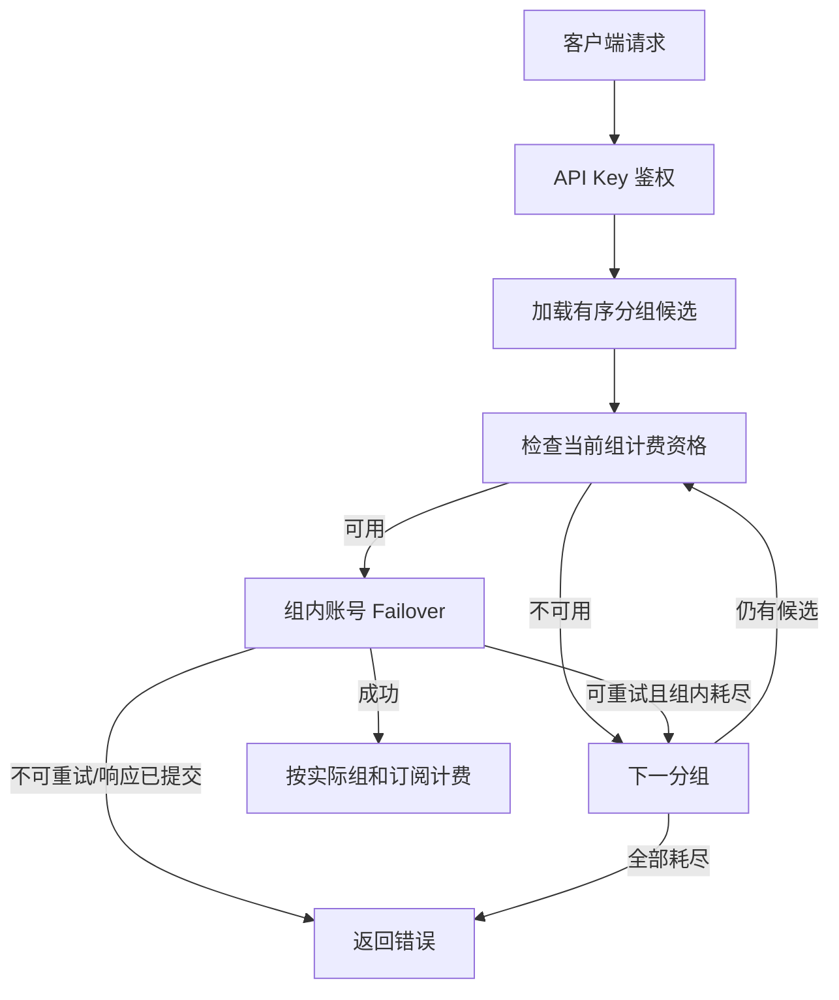

# 技术设计: API Key 有序多分组容灾

## 技术方案

### 核心技术
- PostgreSQL 有序关联表与 Ent schema。
- 现有 API Key 认证缓存和 `FailoverState` 状态机。
- Vue 3 与已安装的 `vue-draggable-plus`。

### 实现要点
- 新增 `api_key_groups(api_key_id, group_id, priority)`；唯一约束防止重复分组和重复优先级。
- `api_keys.group_id` 暂时保留为第一优先级兼容镜像；业务读取以有序关联表为准。
- `group_ids` 为有序数组，限制 1-5 个、去重、同平台，并逐个校验用户绑定权限。
- 认证缓存保存完整有序候选分组快照；分组或 Key 变更时失效相关 L1/Redis 缓存。
- 每个请求创建独立候选状态，从第一组开始检查计费资格和订阅候选。
- 当前组内部先沿用现有账号/凭证 failover；候选账号耗尽或可重试错误耗尽后才推进下一组。
- 切组时重建实际 API Key/Group 上下文、重新检查计费资格与分组限制，并重置账号排除集合。
- 成功分组成为本请求唯一计费和用量归属，不修改 API Key 的持久化顺序。

## 架构设计



## 架构决策 ADR

### ADR-20260718-APIKEY-GROUPS-001: 使用有序关联表保存候选分组
**上下文:** API Key 需要可查询、可约束、可迁移的分组顺序，并支持分组删除和缓存失效。
**决策:** 新建 `api_key_groups`，以 `(api_key_id, priority)` 表达严格顺序。
**理由:** 比 JSONB 或逗号字符串具有更好的外键完整性、查询能力和演进空间。
**替代方案:** 在 `api_keys` 保存 JSONB 数组 → 拒绝原因: 分组引用、删除、统计和缓存失效难以可靠维护。
**影响:** API Key repository 写操作需要事务同步关联表和首组兼容字段。

### ADR-20260718-APIKEY-GROUPS-002: 复用组内 Failover 并增加外层分组推进
**上下文:** 现有 `FailoverState` 已处理账号切换、临时封禁和可重试错误，重复实现会产生错误分类偏差。
**决策:** 保持组内状态机，在其耗尽点增加分组推进与状态重置。
**理由:** 最小化行为差异，并让所有主要网关协议共享同一错误边界。
**替代方案:** 使用中间件捕获并重放整个 HTTP 请求 → 拒绝原因: 流式响应、请求体和异步任务难以安全重放。
**影响:** Chat Completions、Responses、Gemini 及通用网关循环需要接入共享切组方法。

### ADR-20260718-APIKEY-GROUPS-003: 保留 group_id 作为兼容镜像
**上下文:** 现有 API、过滤、统计和外部客户端依赖单值 `group_id`。
**决策:** `group_ids[0]` 同步写入 `group_id`，新逻辑以关联表为准。
**理由:** 避免一次性破坏全部调用方，并允许渐进迁移。
**替代方案:** 立即删除 `group_id` → 拒绝原因: 破坏性过大且与本功能目标无关。
**影响:** 必须用事务和一致性测试防止双写漂移。

## API设计

### POST /api/v1/keys
- **请求:** 新增 `group_ids: number[]`，按数组顺序表示优先级；兼容旧 `group_id`。
- **响应:** 返回 `group_ids`，`group_id` 等于首组。

### PUT /api/v1/keys/:id
- **请求:** `group_ids` 存在时整体替换并重排；仅有 `group_id` 时替换为单分组链。
- **校验:** 1-5 个、正整数、去重、同平台、全部可绑定。

## 数据模型

```sql
CREATE TABLE api_key_groups (
    id BIGSERIAL PRIMARY KEY,
    api_key_id BIGINT NOT NULL REFERENCES api_keys(id) ON DELETE CASCADE,
    group_id BIGINT NOT NULL REFERENCES groups(id),
    priority SMALLINT NOT NULL CHECK (priority >= 0 AND priority < 5),
    UNIQUE (api_key_id, group_id),
    UNIQUE (api_key_id, priority)
);

CREATE INDEX idx_api_key_groups_group_id ON api_key_groups(group_id);
```

迁移将所有非空 `api_keys.group_id` 写入优先级 0；不执行生产迁移。

## 安全与性能
- **权限:** 每个候选分组均执行现有公开/专属/订阅绑定校验；禁止跨用户和跨平台组合。
- **重放安全:** Writer 已提交、客户端取消、非重试错误或异步任务可能已创建时立即终止。
- **计费:** 切组前重新选择订阅并检查余额；只按最终成功分组写用量，沿用请求级幂等键。
- **性能:** 候选最多 5 个并进入认证缓存；数据库认证查询一次加载有序候选，避免逐组查询。
- **兼容:** 旧 Key、旧请求和 `group_id` 过滤继续可用；关联表为新真实来源。

## 测试与部署
- **后端:** migration、repository 顺序/事务、权限和同平台校验、认证缓存、订阅耗尽、余额不足、账号耗尽、429/5xx/超时跨组、不可重试和响应提交边界。
- **协议:** Chat Completions、Responses、Gemini 和通用网关至少各覆盖一条跨组路径；异步媒体验证禁止不安全重放。
- **前端:** 多选、最多 5 个、拖拽排序、编辑回填、兼容响应与提交载荷。
- **回归:** `go generate ./ent`、`go test ./...`、后端构建、前端定向测试、类型检查和生产构建。
- **部署:** 先备份数据库，在非生产环境运行迁移并验证旧 Key 回填；本次开发不直接操作生产数据库。
