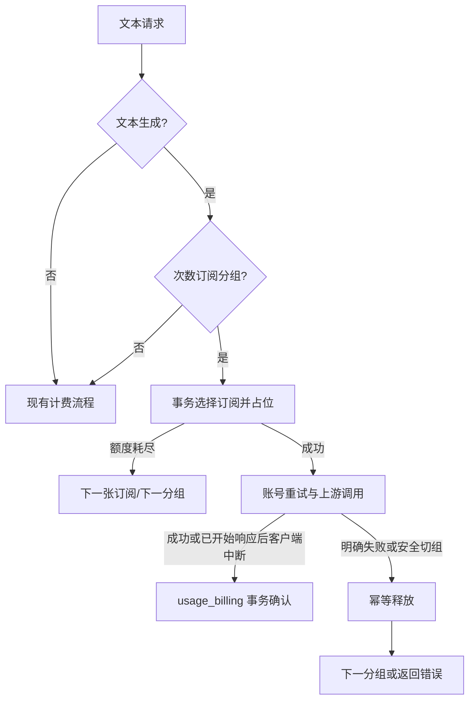

# 技术设计: 纯次数订阅套餐

## 技术方案

### 核心技术
- PostgreSQL 行锁、条件更新和唯一约束保证次数占位精确性。
- Ent schema 与顺序 SQL migration 保持数据模型一致。
- 复用 `SubscriptionService`、多订阅候选选择、API Key 多分组容灾和 `usage_billing` 幂等事务。
- Vue 现有分组表单、套餐预览和订阅进度组件。

### 实现要点
- `groups.subscription_billing_mode` 默认为 `usd`；`request_count` 模式读取 `request_limit_5h`、`request_limit_1d`。
- `user_subscriptions` 保存 5 小时、24 小时窗口起点与占用计数。占用计数包含已确认和当前 pending 请求，失败释放后回退。
- 新增 `subscription_request_reservations`，记录逻辑请求、API Key、具体订阅、窗口快照、状态和过期时间。
- `ReserveTextRequest` 在事务内回收同订阅过期占位、推进过期窗口、按 `expires_at ASC, id ASC` 选择第一张可用订阅、增加两个窗口计数并创建 pending 占位。
- 同一 `request_id + subscription_id` 重试返回既有占位，不重复增加计数；账号级重试复用占位，跨组时释放旧占位并创建新占位。
- 成功用量写入时把 reservation ID 传入 `UsageBillingCommand`，在现有幂等事务中将 pending 改为 committed。次数模式的 `SubscriptionCost` 固定为 0。
- 明确失败、请求校验失败和安全切组路径调用幂等 `ReleaseTextRequest`；仅当当前窗口起点仍与占位快照一致时递减计数。
- 不新增 Redis 计数和常驻清理 worker。过期 pending 在下一次同订阅占位时回收，降低额外运行组件和一致性面。

## 架构设计


## 架构决策 ADR

### ADR-20260720-COUNT-SUB-001: 次数配置绑定订阅分组
**上下文:** 现有套餐只负责价格和有效期，实际权益限额由分组定义；用户要求继续使用“创建分组，再创建套餐”的流程。
**决策:** 次数计费模式和窗口上限保存在 `groups`，套餐继续只关联 `group_id`。
**理由:** 与现有 USD 订阅一致，不增加套餐快照和新的商品管理入口。
**替代方案:** 在 `subscription_plans` 保存次数限制并发放时复制到订阅 → 拒绝原因: 重复权益配置，改变现有分组即权益模板的模型。
**影响:** 不同次数权益使用不同分组；同一分组绑定的套餐共享次数规则。

### ADR-20260720-COUNT-SUB-002: PostgreSQL 占位账本保证成功扣次
**上下文:** 成功后直接累加会在高并发下超发；请求前直接扣次又无法在失败时可靠恢复。
**决策:** 请求前增加占用计数并写 pending 账本，成功只确认状态，失败按窗口快照释放。
**理由:** 数据库是订阅权益 SSOT，可与现有计费幂等事务组合，故障恢复可审计。
**替代方案:** Redis 占位和异步落库 → 拒绝原因: 需要处理双写、跨实例恢复和缓存丢失，当前没有吞吐证据证明必要。
**影响:** 每个次数文本请求增加一次短事务；成功确认并入既有计费事务，失败增加一次条件更新。

### ADR-20260720-COUNT-SUB-003: 占位时增加计数，失败时回退
**上下文:** 严格上限要求并发中的请求也占用容量，但最终只有成功请求应保留次数。
**决策:** `request_usage_*` 表示已确认加 pending 占用；成功不再加数，失败释放时递减。
**理由:** 限额检查只比较一组整数，无需每次聚合占位表，事务路径最短。
**替代方案:** 分开保存 confirmed 与 reserved 两套计数 → 拒绝原因: 字段、更新分支和展示规则更多，没有额外业务价值。
**影响:** 用户界面可能短暂显示在途请求占用，失败结束后自动恢复。

## API设计

### POST/PUT /api/v1/admin/groups
- **请求新增:** `subscription_billing_mode: "usd" | "request_count"`、`request_limit_5h?: number`、`request_limit_1d?: number`。
- **校验:** 仅订阅分组允许 `request_count`；上限必须是非负整数，两个窗口不能同时为 0；次数模式清空 USD 限额。
- **响应新增:** 返回上述字段，供分组列表、套餐预览和编辑回填。

### GET /api/v1/subscriptions/progress
- **响应新增:** `billing_mode`；次数模式返回 `request_5h`、`request_1d`，每项包含 `limit`、`used`、`remaining`、`reset_at`。
- **兼容:** USD 套餐继续返回现有 daily/weekly/monthly 结构。

### 网关错误
- `REQUEST_COUNT_5H_EXCEEDED`：5 小时次数耗尽。
- `REQUEST_COUNT_1D_EXCEEDED`：24 小时次数耗尽。
- 对外返回 429，并附可用的最近 `reset_at`；不暴露具体订阅 ID 或内部账号。

## 数据模型
```sql
ALTER TABLE groups
    ADD COLUMN subscription_billing_mode VARCHAR(20) NOT NULL DEFAULT 'usd',
    ADD COLUMN request_limit_5h INTEGER NOT NULL DEFAULT 0,
    ADD COLUMN request_limit_1d INTEGER NOT NULL DEFAULT 0;

ALTER TABLE user_subscriptions
    ADD COLUMN request_usage_5h INTEGER NOT NULL DEFAULT 0,
    ADD COLUMN request_usage_1d INTEGER NOT NULL DEFAULT 0,
    ADD COLUMN request_window_5h_start TIMESTAMPTZ,
    ADD COLUMN request_window_1d_start TIMESTAMPTZ;

CREATE TABLE subscription_request_reservations (
    id BIGSERIAL PRIMARY KEY,
    request_id VARCHAR(128) NOT NULL,
    api_key_id BIGINT NOT NULL,
    user_id BIGINT NOT NULL,
    subscription_id BIGINT NOT NULL,
    status VARCHAR(20) NOT NULL DEFAULT 'pending',
    window_5h_start TIMESTAMPTZ,
    window_1d_start TIMESTAMPTZ,
    expires_at TIMESTAMPTZ NOT NULL,
    created_at TIMESTAMPTZ NOT NULL DEFAULT NOW(),
    updated_at TIMESTAMPTZ NOT NULL DEFAULT NOW(),
    UNIQUE (request_id, subscription_id)
);

CREATE INDEX idx_subscription_request_reservations_pending_expiry
    ON subscription_request_reservations (subscription_id, expires_at)
    WHERE status = 'pending';
```

约束和外键在正式 migration 中补齐；状态仅允许 `pending`、`committed`、`released`。占位过期时间复用现有 Gateway 请求超时并增加安全余量，不新增管理员配置项。

## 请求状态机
1. Handler 完成 endpoint、模型和媒体意图识别，确认是文本生成请求。
2. 次数分组调用 `ReserveTextRequest`；事务锁定候选订阅，完成窗口维护与上限检查。
3. 账号级重试保持 reservation 不变；安全跨组前释放，再由新组重新占位。
4. 非流式有效成功响应进入 `RecordUsage`；流式正常终止或客户端在上游开始响应后中断进入成功确认。
5. `usage_billing.Apply` 使用原有 request 幂等键，并在同一事务确认 reservation。
6. 请求未发送、上游明确失败、超时且无成功响应、不可重试错误或全部账号耗尽时释放 reservation。

## 安全与性能
- **权限:** 占位必须同时匹配当前用户、API Key、分组和具体订阅；客户端不能提交 reservation ID。
- **隐私:** 占位表不保存请求体、提示词、响应或密钥。
- **一致性:** 所有状态转换使用 `WHERE status = 'pending'`，重复确认或释放均为 no-op；释放只修改相同窗口代次的计数。
- **性能:** 候选索引和 pending 到期索引限制锁范围；首版使用 PostgreSQL 短事务，不新增 Redis 双写。
- **可恢复性:** 过期 pending 在下一次同订阅占位事务中回收；管理端可通过审计查询异常占位，但首版不增加人工操作页面。
- **EHRB:** 涉及权益数据库迁移，上线前必须备份并先在副本验证迁移与回滚。

## 测试与部署
- **单元测试:** 分组字段校验、请求分类、窗口推进、耗尽错误、多卡选择、重复 reserve/commit/release 幂等。
- **并发集成测试:** 同一订阅并发 N+M 个请求时仅 N 个成功占位；失败释放后可再次占位；跨窗口释放不误减新窗口。
- **Gateway 回归:** Messages、Chat Completions、Responses、Gemini 文本同步/流式、客户端中断、账号重试、跨组 failover。
- **排除回归:** count_tokens、图片、视频、批量任务和查询接口不占次数；USD 套餐保持原计费。
- **前端:** 分组创建/编辑、套餐预览、用户进度、错误提示、类型检查和构建。
- **部署:** 备份 PostgreSQL；执行 migration/Ent 生成一致性检查；滚动发布后端；发布前端；观察 429、pending 数和占位事务延迟。
