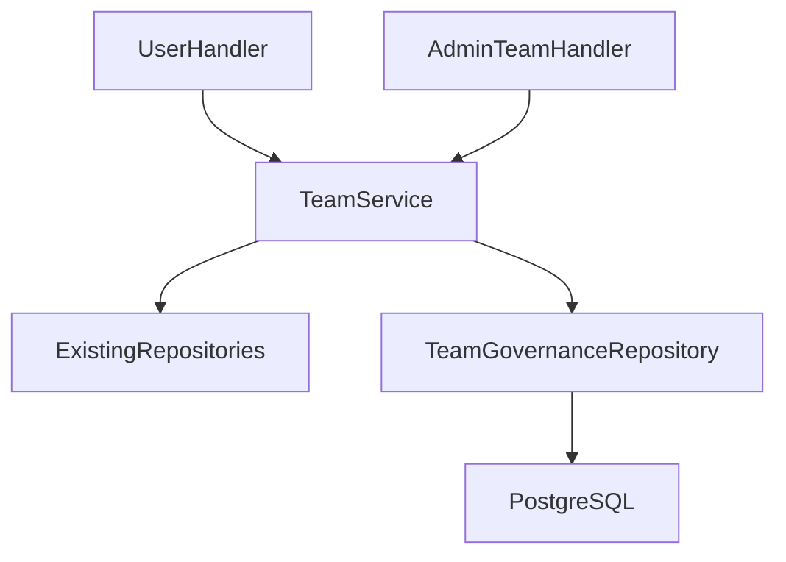

# 技术设计: 团队治理与资金防滥用

## 技术方案
### 核心技术
- Go、Gin、PostgreSQL 原生事务、Vue 3、TypeScript。

### 实现要点
- 在现有 TeamService 上增加治理接口，既有 Team/User Repository 继续处理旧字段，新字段与新表由独立 `TeamGovernanceRepository` 处理。
- migration 初始化现有团队的上限和复审标识，并把现有用户余额初始化为可转赠额度。
- 资金和人数变化使用数据库事务及行锁，业务层不做跨仓储的非原子余额回滚。

## 架构设计


## 架构决策 ADR
### ADR-TEAM-001: 团队治理使用原生 SQL 扩展仓储
**上下文:** 当前工作区存在另一功能的大量 Ent schema 和生成文件改动。
**决策:** 本功能只新增 SQL migration 和原生 SQL repository，不修改 Ent schema。
**理由:** 避免覆盖并行改动，缩小生成代码冲突，同时原生事务更适合人数和余额条件更新。
**替代方案:** 扩展 Ent schema 并重新生成 → 拒绝原因: 会改写当前用户未提交的生成文件。
**影响:** 新增查询需要手工扫描字段，但边界集中在一个仓储文件内。

## API设计
- **用户:** 创建申请、申请状态、加入申请、owner 审批、检查升级、扩容申请、可转赠余额。
- **管理员:** 团队列表/详情、治理配置、申请审核、冻结恢复、移除成员、设置上限、完成复审。

## 数据模型
```sql
ALTER TABLE teams ADD COLUMN member_limit INTEGER;
CREATE TABLE team_applications (...);
CREATE TABLE team_join_requests (...);
CREATE TABLE team_governance_settings (...);
CREATE TABLE team_transferable_balances (...);
CREATE TABLE team_fund_ledger (...);
```

## 安全与性能
- **安全:** 所有 owner/admin 操作从鉴权上下文取主体；审核、冻结和资金操作写审计字段；禁止客户端传审核人和来源。
- **性能:** 团队列表使用分页聚合；申请和状态建立部分索引；余额与人数用行锁和条件更新保证并发正确性。

## 测试与部署
- **测试:** migration 回归、服务条件计算、权限、并发超员、可转赠额度和前端交互测试。
- **部署:** 本次只完成代码与本地验证；生产部署需单独确认并先备份数据库。
