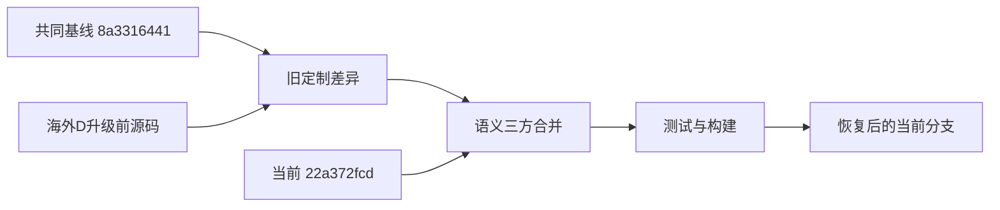

# 技术设计: 恢复海外D未入库功能

## 技术方案

### 核心技术
- 使用三方差异：共同基线 `8a3316441`、海外D升级前源码 `/opt/sub2api-wt3.tar.gz`、当前分支 `22a372fcd`。
- 当前分支是唯一目标基线；仅移植旧源码相对共同基线新增的语义，不复制整棵目录。
- 后端延续 Go、Gin、Ent、PostgreSQL、Wire 模式；前端延续 Vue 3、Pinia、Tailwind CSS 和现有共享组件。

### 实现要点
- 先恢复数据模型、领域常量、仓储和服务，再恢复 Handler/DTO；Ent 与 Wire 通过项目生成命令产生，不手工维护派生文件。
- 旧 `188_redeem_code_pool_key.sql` 改为 `191_redeem_code_pool_key.sql`，使用幂等 `ADD COLUMN IF NOT EXISTS` 和约束重建。
- `lottery_chance` 的 `value` 必须是正整数，`pool_key` 必须是 `normal` 或 `luxury`；兑换写入现有抽奖流水并使用兑换码 ID 构造幂等来源。
- `dashboard_notice` 走现有设置读取、更新、审计和公共设置缓存链路，前端只渲染纯文本。
- 48 个完全回退文件可从旧差异移植；26 个分叉文件逐个合并当前新增字段、接口和测试。
- 页面恢复以现有业务脚本和 API 合同为准，只移植旧布局、展示和必要交互；不恢复旧机器专用端口覆盖文件。

## 架构设计


## 架构决策 ADR

### ADR-001: 使用语义三方合并而非旧源码覆盖
**上下文:** 海外D旧源码包含未入库定制，当前分支同时包含 v0.1.163 新功能和修复。
**决策:** 当前分支保持为目标，只移植旧源码相对共同基线的差异。
**理由:** 可同时保留定制功能与新版修复，且每个冲突可测试和审计。
**替代方案:** 整包覆盖或回滚旧镜像 → 拒绝原因: 会重新造成仓库、源码和生产镜像分叉，并存在数据库兼容风险。
**影响:** 合并工作量较大，但结果可持续维护并可正常提交。

### ADR-002: 恢复迁移使用编号 191
**上下文:** 旧定制占用 migration 188，而官方 v0.1.163 已固定使用 188-190。
**决策:** 新迁移命名为 `191_redeem_code_pool_key.sql`。
**理由:** 不修改生产迁移历史和 checksum，保持顺序执行。
**替代方案:** 覆盖官方 188 → 拒绝原因: 会破坏已部署数据库的一致性。
**影响:** 旧功能代码需与新编号一起纳入 migration 回归测试。

## API设计

### POST /api/v1/admin/redeem-codes/generate
- **请求扩展:** `type=lottery_chance` 时增加 `pool_key: normal | luxury`，`value` 为正整数次数。
- **响应:** 延续现有兑换码响应，并返回 `pool_key`。

### POST /api/v1/redeem
- **行为扩展:** 兑换 `lottery_chance` 时增加当前用户指定奖池的额外次数。
- **错误:** 缺少或非法 `pool_key` 返回兑换码无效；重复兑换沿用现有冲突语义。

### 公共设置与管理设置接口
- **字段扩展:** `dashboard_notice: string`。
- **行为:** 空字符串关闭展示；审计日志记录字段变化，不记录敏感信息。

## 数据模型
```sql
ALTER TABLE redeem_codes
    ADD COLUMN IF NOT EXISTS pool_key VARCHAR(16);

ALTER TABLE redeem_codes
    ADD CONSTRAINT redeem_codes_pool_key_check
    CHECK (pool_key IS NULL OR pool_key IN ('normal', 'luxury'));
```

## 安全与性能
- **安全:** 管理接口继续使用现有权限；奖池和值双端校验；公告仅按文本渲染；兑换发放保持事务和幂等。
- **数据安全:** 不修改官方 migration，不连接生产数据库，不操作海外D容器。
- **性能:** 新字段可空且不参与高频过滤，不新增索引；页面只复用现有请求，不增加轮询。

## 测试与部署
- **后端:** 运行兑换码、抽奖、设置相关单测，migration 回归测试，以及受影响包的 `go test`。
- **生成:** 按项目命令重新生成 Ent/Wire，确认生成结果与 schema 一致。
- **前端:** 运行相关 Vitest、`vue-tsc --noEmit` 和生产构建。
- **视觉:** 在桌面和移动视口核对团队、抽奖、仪表盘和管理页的布局，无重叠与溢出。
- **部署:** 本次只完成本地恢复；生产部署需另行确认，并在数据库备份后执行 migration 与镜像发布。
