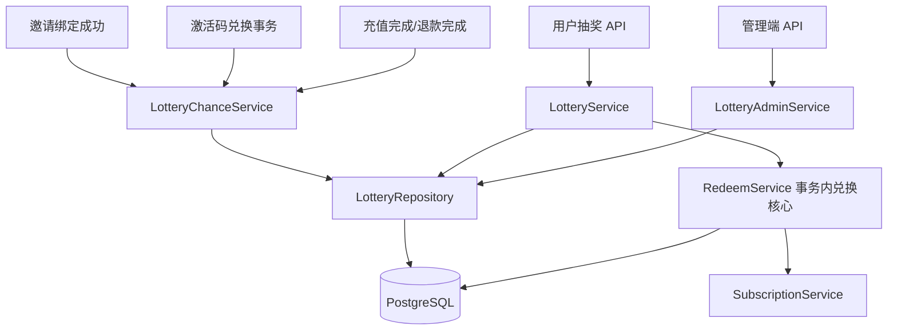
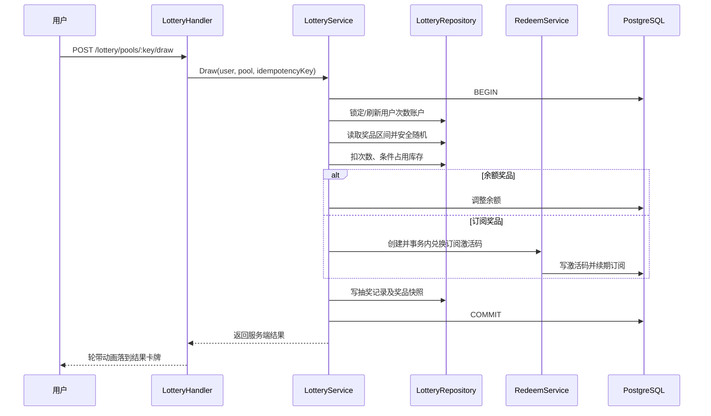

# 技术设计: 双奖池邀请抽奖系统

## 技术方案

### 核心技术
- **后端:** Go、Gin、Ent 事务上下文、PostgreSQL 原生约束与行锁。
- **前端:** Vue 3、TypeScript、现有组件和 CSS transform 动画。
- **复用:** Affiliate 邀请归因、Payment 完成/退款事件、Redeem 激活码、Subscription 续期、`ImageUpload`、写接口幂等协调器。
- **新增依赖:** 无。

### 模块边界

- `LotteryChanceService`: 计算注册、激活码、充值及退款规则，更新长期额外次数并写不可变流水；不依赖兑换码服务。
- `LotteryService`: 查询用户摘要、惰性刷新周期基础次数、执行抽奖和自动发奖。
- `LotteryAdminService`: 校验并维护两个奖池、奖品、规则及审计查询。
- `LotteryRepository`: 使用 SQL 操作抽奖领域表，并复用 `dbent.TxFromContext` 中的外层事务。

此拆分只用于解除 `RedeemService -> LotteryChanceService` 与 `LotteryService -> RedeemService` 的依赖环，不扩展为通用事件或营销引擎。

### 实现要点

1. 数据库迁移固定创建 `normal`、`luxury` 两个奖池；管理端仅更新，不允许新增或删除奖池。
2. 周期基础次数保存在用户次数账户中，通过 `period_key` 惰性刷新；额外次数单独保存且永不过期。
3. 每次规则发放和冲正同时更新次数账户并写流水，唯一键负责事件幂等。
4. 抽奖事务锁定用户次数账户，服务端安全随机后扣次、占库存、发奖并写结果。
5. 订阅奖品调用新的事务内兑换核心：创建激活码、标记使用、分配/续期订阅均复用同一个 `txCtx`。
6. 用户写接口要求 `Idempotency-Key` 并复用现有幂等协调器，前端同时禁用重复点击。

## 架构设计

### 抽奖时序

## 架构决策 ADR

### ADR-LOTTERY-001: 使用领域专用表和固定事件类型
**上下文:** 当前只需要两个奖池和注册、激活码、充值三类事件。

**决策:** 新建抽奖领域表和固定枚举规则，直接接入现有成功节点。

**理由:** 能以数据库约束保证概率、库存、次数和事件幂等，同时保持管理查询清晰。

**替代方案:** 设置 JSON + 通用流水 -> 拒绝原因: 并发库存和历史快照难以可靠维护；通用营销规则引擎 -> 拒绝原因: 超出当前范围。

**影响:** 后续新增全新事件类型需要迁移和代码变更，但当前行为明确、维护成本最低。

### ADR-LOTTERY-002: 抽奖结果由服务端安全随机确定
**上下文:** 前端轮带动画不能成为可信概率来源。

**决策:** 概率使用整数 `probability_ppm`（百万分比），通过 `crypto/rand` 生成 `[0, 1_000_000)` 的均匀值；前端只展示返回结果。

**理由:** 避免浮点边界、客户端篡改和可预测随机数。

**替代方案:** `math/rand` 或前端随机 -> 拒绝原因: 可预测或可篡改。

**影响:** 概率总和小于 1,000,000、禁用或无库存奖品区间均落为未中奖，不重新归一化。

### ADR-LOTTERY-003: 兑换码核心支持复用外层事务
**上下文:** 当前 `RedeemService.Redeem` 固定自行开启事务，`redeemCodeRepository` 部分读写也未统一使用 `clientFromContext`，无法纳入抽奖原子事务。

**决策:** 提取事务内兑换核心并修正 repository 的事务客户端选择；公开兑换保留限流、锁、事务所有权及提交后缓存失效，抽奖使用系统订阅码入口并由外层提交后执行缓存失效。

**理由:** 后续订阅发放仍统一经过兑换码逻辑，同时保证抽奖失败不产生部分权益。

**替代方案:** 抽奖直接调用 `SubscriptionService` -> 拒绝原因: 形成第二个订阅入口；抽奖提交后再兑换 -> 拒绝原因: 会产生中奖但未到账状态。

**影响:** 需要补充公开兑换与外层事务两组回归测试；系统生成的抽奖码不触发邀请激活奖励。

## 数据模型

### `lottery_pools`

固定两行奖池配置。

| 字段 | 类型 | 说明 |
|------|------|------|
| id | BIGSERIAL | 主键 |
| key | VARCHAR(16) UNIQUE | `normal` / `luxury` |
| name | VARCHAR(80) | 展示名称 |
| enabled | BOOLEAN | 启用状态 |
| cycle_type | VARCHAR(16) | `daily` / `weekly` |
| cycle_chances | INTEGER | 每周期基础次数 |
| starts_at / ends_at | TIMESTAMPTZ | 可选活动时间 |
| created_at / updated_at | TIMESTAMPTZ | 审计时间 |

### `lottery_prizes`

| 字段 | 类型 | 说明 |
|------|------|------|
| id / pool_id | BIGSERIAL / BIGINT | 主键及奖池外键 |
| name / description | VARCHAR / TEXT | 卡牌文案 |
| image_data | TEXT | 可选安全图片 Data URL |
| prize_type | VARCHAR(16) | `balance` / `subscription` |
| balance_amount | NUMERIC(20,8) | 余额奖品金额 |
| group_id / validity_days | BIGINT / INTEGER | 订阅分组及天数 |
| probability_ppm | INTEGER | 0 至 1,000,000 |
| stock_total / stock_used | BIGINT / BIGINT | `stock_total IS NULL` 表示无限 |
| enabled / sort_order | BOOLEAN / INTEGER | 状态及顺序 |
| created_at / updated_at | TIMESTAMPTZ | 审计时间 |

约束保证奖品类型字段互斥、概率合法、库存非负且 `stock_used <= stock_total`。

### `lottery_rules`

| 字段 | 类型 | 说明 |
|------|------|------|
| id / name | BIGSERIAL / VARCHAR | 主键及名称 |
| event_type | VARCHAR(16) | `signup` / `redeem` / `recharge` |
| beneficiary | VARCHAR(16) | `inviter` / `invitee` |
| normal_chances / luxury_chances | INTEGER | 两池奖励次数，至少一个大于 0 |
| recharge_mode | VARCHAR(16) | `single` / `cumulative`，非充值规则为空 |
| recharge_threshold | NUMERIC(20,8) | 充值门槛 |
| repeatable | BOOLEAN | 后续达标是否继续有效 |
| enabled | BOOLEAN | 启用状态 |
| created_at / updated_at | TIMESTAMPTZ | 审计时间 |

### `lottery_user_chances`

| 字段 | 类型 | 说明 |
|------|------|------|
| user_id / pool_id | BIGINT / BIGINT | 联合唯一键 |
| period_key | VARCHAR(32) | 当前站点时区周期键 |
| base_remaining | INTEGER | 本周期基础次数 |
| extra_remaining | BIGINT | 长期额外次数 |
| updated_at | TIMESTAMPTZ | 更新时间 |

### `lottery_chance_ledger`

| 字段 | 类型 | 说明 |
|------|------|------|
| id / user_id / pool_id | BIGSERIAL / BIGINT / BIGINT | 主键及受益人 |
| action | VARCHAR(24) | `grant` / `refund_reversal` / `draw` |
| base_delta / extra_delta | INTEGER / BIGINT | 次数变化 |
| rule_id | BIGINT | 可选规则快照来源 |
| source_type / source_id | VARCHAR | 注册、兑换、订单、退款或抽奖来源 |
| source_user_id / tier_no | BIGINT / INTEGER | 被邀请人及累计门槛档位 |
| balance_after | JSONB | 变更后基础/额外次数快照 |
| metadata | JSONB | 规则、冲正不足等审计信息 |
| created_at | TIMESTAMPTZ | 不可变记录时间 |

唯一索引覆盖 `(rule_id, source_type, source_id, user_id, pool_id, tier_no, action)`，确保重复事件幂等；抽奖消费以 draw id 作为来源。

### `lottery_draws`

| 字段 | 类型 | 说明 |
|------|------|------|
| id / user_id / pool_id | BIGSERIAL / BIGINT / BIGINT | 抽奖记录 |
| outcome | VARCHAR(16) | `win` / `none` |
| chance_source | VARCHAR(16) | `base` / `extra` |
| prize_id / redeem_code_id | BIGINT | 可选奖品和订阅激活码 |
| random_roll | INTEGER | 服务端随机值审计 |
| prize_snapshot | JSONB | 名称、类型、数值、概率和卡面快照 |
| created_at | TIMESTAMPTZ | 抽奖时间 |

## 规则计算

### 注册
邀请关系首次绑定后，对每条启用的注册规则按受益人和两个奖池分别生成幂等流水。自邀继续由现有邀请服务拒绝。

### 首次激活码
用户成功兑换任意非 `invitation` 类型兑换码时，在同一兑换事务内检查该被邀请人是否已有成功兑换来源流水；仅第一次计算所有启用规则。抽奖内部生成的订阅码设置系统来源并跳过此事件。

### 充值
- **单笔:** `order.amount >= threshold`；不可重复规则只取第一笔达标订单，可重复规则按订单 id 发放。
- **累计:** `tier = floor(net_completed_recharge / threshold)`；不可重复规则上限为 1，可重复规则发放尚未出现的 `1..tier` 档位。
- **退款:** 重新计算净累计档位，从最高档开始写冲正；单笔规则冲正该退款订单对应发放。

## API 设计

### 用户接口

#### `GET /api/v1/lottery`
- **响应:** 两个奖池公开配置、基础/额外剩余次数、启用奖品及概率、近期历史摘要。

#### `POST /api/v1/lottery/pools/:key/draw`
- **请求头:** `Idempotency-Key` 必填。
- **响应:** draw id、结果、奖品快照、剩余次数；不返回随机算法内部状态之外的管理配置。

#### `GET /api/v1/lottery/history`
- **请求:** 标准分页和可选奖池筛选。
- **响应:** 当前用户自己的抽奖历史。

### 管理接口

- `GET /api/v1/admin/lottery/pools`
- `PATCH /api/v1/admin/lottery/pools/:key`
- `GET|POST /api/v1/admin/lottery/prizes`
- `PATCH|DELETE /api/v1/admin/lottery/prizes/:id`
- `GET|POST /api/v1/admin/lottery/rules`
- `PATCH|DELETE /api/v1/admin/lottery/rules/:id`
- `GET /api/v1/admin/lottery/draws`
- `GET /api/v1/admin/lottery/chance-ledger`

所有管理写接口复用现有管理员鉴权、审计和写幂等模式。已被历史记录引用的奖品或规则使用停用/软删除语义，不物理破坏历史。

## 前端设计

### 用户页
- 普通/豪华使用紧凑页签；首屏同时展示轮带、剩余次数和抽奖按钮，并露出奖品概率列表。
- 轮带保持固定卡宽和容器高度，以重复奖品卡组成足够长的序列；服务端返回后计算终点，使用 CSS transform 分段减速。
- 动画期间用同页内容的模糊遮罩突出前景轮带，不使用装饰性渐变球或嵌套卡片。
- `prefers-reduced-motion` 下跳过长距离滚动并直接显示结果弹层。

### 管理页
- 使用“奖池 / 奖品 / 邀请规则 / 记录”页签。
- 奖池用分段控件选择每日/每周、数字输入配置次数、开关控制启用、原生日期时间输入配置活动范围。
- 奖品编辑器按类型切换余额金额或订阅分组/天数，复用 `ImageUpload`；概率输入显示百分比并转换为 ppm。
- 规则编辑器固定三类事件字段，不提供表达式编辑器。

## 安全与性能

- 使用 `crypto/rand`；禁止由前端传入结果、奖品 id 或概率。
- 抽奖事务 `SELECT ... FOR UPDATE` 锁定用户次数账户，固定库存使用条件更新，所有计数拒绝负数。
- 概率、金额、天数、时间范围、Data URL 在后端再次校验；图片仅允许 PNG/JPEG/WebP 且解码后不超过 300KB。
- 用户只能读取自己的次数和历史；管理接口继续经过 AdminAuth 和合规中间件。
- 列表均分页；为用户时间、奖池时间、规则来源和未退款流水建立组合索引。
- 日/周次数惰性刷新，不新增 cron、队列或 Redis 状态。

## 测试与部署

- **单元测试:** 周期键、规则匹配/累计档位/退款冲正、概率边界、图片和配置校验、动画终点。
- **集成测试:** 并发扣次、固定库存最后一份、事件幂等、事务回滚、订阅码创建并兑换、退款不足冲正。
- **API 测试:** 用户隔离、管理员权限、写幂等、分页和错误码。
- **前端测试:** 两奖池状态、按钮禁用、精确概率、轮带落点、减少动态效果及管理表单。
- **构建验证:** `go test ./...`、前端类型检查/单测/构建及迁移回归测试。
- **部署:** 本方案完成后仅提交代码；生产部署仍需用户另行明确授权。迁移 176 随后端启动执行，发布前备份生产数据库。
