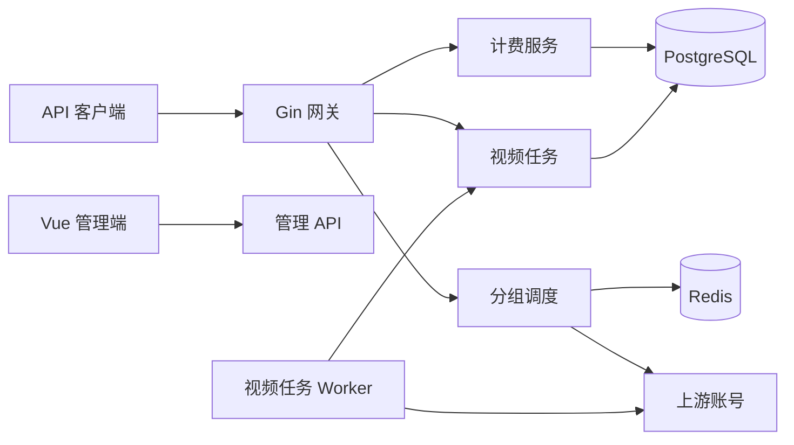

# 架构设计

## 总体架构

## 核心约束
- API Key 绑定分组，分组平台决定协议与账号池。
- Redis 负责并发、短期缓存和粘性会话；PostgreSQL 保存长期事实。
- 用量扣费通过 `usage_billing_dedup` 保证同一请求最多应用一次。
- 视频扣余额与 `video_tasks` 写入在同一数据库事务中提交。
- Worker 使用数据库租约领取任务；未知状态和传输错误继续重试，只有上游明确失败终态才退款。
- 失败退款在数据库事务内锁定任务并更新余额、任务和用量记录，重复执行不重复退款。

## 重大架构决策

| adr_id | title | date | status | affected_modules | details |
|--------|-------|------|--------|------------------|---------|
| ADR-VIDEO-001 | 视频任务持久化与余额补偿 | 2026-07-11 | ✅已实施 | 账号、分组、网关、计费 | [方案](../plan/202607110153_video_platform/how.md#adr-video-001-视频任务持久化与余额补偿) |
