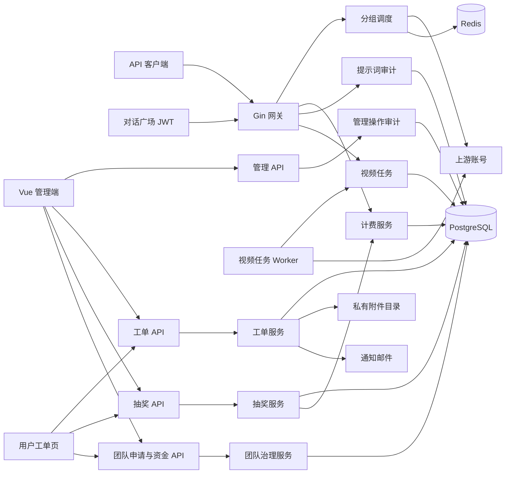

# 架构设计

## 总体架构

## 核心约束
- API Key 通过有序关联绑定 1-5 个同平台分组，首组决定初始协议与账号池；每个请求都从首组重新开始。
- Redis 负责并发、短期缓存和粘性会话；PostgreSQL 保存长期事实。
- 用量扣费通过 `usage_billing_dedup` 保证同一请求最多应用一次。
- 管理操作审计与提示词审计使用独立存储和权限边界；敏感管理员操作通过 step-up 2FA 再验证。
- 异步图片任务只在对象存储配置完整时启用，Redis 保存紧凑任务状态，图片结果写入 S3 兼容存储。
- 同组多张订阅独立计时和记账，鉴权按最早到期顺序选择当前仍有额度的具体 `subscription_id`。
- 次数订阅在 PostgreSQL 中请求前占位；pending 与已确认请求共同占用容量，成功并入 `usage_billing` 幂等事务确认，失败按窗口快照释放。
- 当前分组计费资格不可用或组内账号安全重试耗尽时按 Key 自定义顺序推进；切组重新检查订阅/余额/RPM 并重置账号 failover 状态。
- 响应已提交、客户端取消、不可重试错误和异步任务可能已创建后禁止跨组重放；成功组写入最终用量与计费记录。
- 视频扣余额与 `video_tasks` 写入在同一数据库事务中提交。
- Worker 使用数据库租约领取任务；未知状态和传输错误继续重试，只有上游明确失败终态才退款。
- 失败退款在数据库事务内锁定任务并更新余额、任务和用量记录，重复执行不重复退款。
- 对话广场通过持久化内部 API Key 复用同一视频调度、计费和退款链路；前端只负责创建、轮询和展示。
- 视频状态查询是已扣费任务的只读操作，保留身份与分组权限校验，不重复执行余额资格检查。
- 工单用户接口始终按登录用户附加所有权边界，越权的工单和附件统一返回不存在；管理员负责人只用于协作和邮件收件人选择，不形成独占权限。
- 工单正文和系统事件不可变，附件保存在非静态目录并通过鉴权接口访问；关闭 30 天后只物理清理附件，文字和删除元数据长期保留。
- 抽奖使用固定普通/豪华双奖池；服务端以百万分比安全随机决定结果，前端轮带只展示已确定结果。
- 抽奖在单个数据库事务内锁定次数与库存并完成余额或订阅发奖；邀请、兑换、充值及退款通过幂等流水发放或冲正额外次数。
- 团队创建和超 40 人扩容由管理员审核，邀请码加入由 owner 审核；申请状态与团队正常/冻结状态分离。
- 团队等级固定为 5/15/40，由 owner 主动检查并只升不降；管理员可随时直接修改单团队人数上限。
- 团队资金操作按团队、用户、可转赠额度统一锁序执行；数据库触发器随符合来源的兑换入账和所有余额下降维护可转赠额度。
- 入口鉴权前拒绝按有界维度聚合到 PostgreSQL，避免高基数原始请求日志无限增长；鉴权缓存跨实例失效通过 PostgreSQL outbox 和 Redis 发布订阅投递，并提供健康状态接口。
- OpenAI/Codex 推理强度策略绑定分组，先执行精确映射，再应用分组上限；API Key 有序候选组仍决定实际使用哪一组策略。

## 重大架构决策

| adr_id | title | date | status | affected_modules | details |
|--------|-------|------|--------|------------------|---------|
| ADR-20260722-UPSTREAM-163-001 | 使用等价快照合并 v0.1.163 | 2026-07-22 | ✅已实施 | 全局架构、版本管理 | [方案](../history/2026-07/202607221830_upstream_0_1_163_merge/how.md#adr-20260722-upstream-163-001-使用等价快照合并) |
| ADR-20260722-UPSTREAM-163-002 | 保留本地迁移历史并顺延官方编号 | 2026-07-22 | ✅已实施 | 数据库、部署 | [方案](../history/2026-07/202607221830_upstream_0_1_163_merge/how.md#adr-20260722-upstream-163-002-保留本地迁移历史) |
| ADR-TEAM-001 | 团队治理使用原生 SQL 扩展仓储 | 2026-07-21 | ✅已实施 | 团队、用户、资金、管理端 | [方案](../history/2026-07/202607210307_team_governance/how.md#adr-team-001-团队治理使用原生-sql-扩展仓储) |
| ADR-20260720-COUNT-SUB-001 | 次数配置绑定订阅分组 | 2026-07-20 | ✅已实施 | 分组、套餐、订阅 | [方案](../history/2026-07/202607202113_request_count_subscription/how.md#adr-20260720-count-sub-001-次数配置绑定订阅分组) |
| ADR-20260720-COUNT-SUB-002 | PostgreSQL 占位账本保证成功扣次 | 2026-07-20 | ✅已实施 | 订阅、网关、计费、数据模型 | [方案](../history/2026-07/202607202113_request_count_subscription/how.md#adr-20260720-count-sub-002-postgresql-占位账本保证成功扣次) |
| ADR-20260720-COUNT-SUB-003 | 占位时增加计数失败时回退 | 2026-07-20 | ✅已实施 | 订阅、计费 | [方案](../history/2026-07/202607202113_request_count_subscription/how.md#adr-20260720-count-sub-003-占位时增加计数失败时回退) |
| ADR-20260718-APIKEY-GROUPS-001 | 使用有序关联表保存候选分组 | 2026-07-18 | ✅已实施 | API Key、分组、数据模型 | [方案](../history/2026-07/202607181905_api_key_group_failover/how.md#adr-20260718-apikey-groups-001-使用有序关联表保存候选分组) |
| ADR-20260718-APIKEY-GROUPS-002 | 复用组内 Failover 并增加分组推进 | 2026-07-18 | ✅已实施 | 鉴权、网关、调度、计费 | [方案](../history/2026-07/202607181905_api_key_group_failover/how.md#adr-20260718-apikey-groups-002-复用组内-failover-并增加外层分组推进) |
| ADR-20260718-APIKEY-GROUPS-003 | 保留 group_id 作为兼容镜像 | 2026-07-18 | ✅已实施 | API、Repository、迁移 | [方案](../history/2026-07/202607181905_api_key_group_failover/how.md#adr-20260718-apikey-groups-003-保留-group_id-作为兼容镜像) |
| ADR-20260718-UPSTREAM-160-001 | 使用快照分支执行三方合并 | 2026-07-18 | ✅已实施 | 全局架构、版本管理 | [方案](../history/2026-07/202607181652_upstream_0_1_160_merge/how.md#adr-20260718-upstream-160-001-使用快照分支执行三方合并) |
| ADR-20260718-UPSTREAM-160-002 | 生成代码统一重建 | 2026-07-18 | ✅已实施 | Ent、Wire、依赖注入 | [方案](../history/2026-07/202607181652_upstream_0_1_160_merge/how.md#adr-20260718-upstream-160-002-生成代码统一重建) |
| ADR-20260718-MULTI-SUB-001 | 独立权益记录并由数据库选择候选 | 2026-07-18 | ✅已实施 | 订阅、鉴权、计费 | [方案](../history/2026-07/202607180325_multi_subscription_consumption/how.md#adr-20260718-multi-sub-001-独立权益记录并由数据库选择候选) |
| ADR-20260718-MULTI-SUB-002 | 每张订阅获得后立即计时 | 2026-07-18 | ✅已实施 | 订阅、用户端 | [方案](../history/2026-07/202607180325_multi_subscription_consumption/how.md#adr-20260718-multi-sub-002-每张订阅获得后立即计时) |
| ADR-20260718-MULTI-SUB-003 | 支付订单关联精确权益 | 2026-07-18 | ✅已实施 | 支付、退款、订阅 | [方案](../history/2026-07/202607180325_multi_subscription_consumption/how.md#adr-20260718-multi-sub-003-支付订单关联精确权益) |
| ADR-20260714-UPSTREAM-MERGE | 按平台保留 Grok/Video 双路由 | 2026-07-14 | ✅已实施 | 网关媒体、账号管理、模型同步 | [方案](../history/2026-07/202607141328_upstream_0_1_153_merge/how.md#adr-20260714-upstream-merge-按平台保留双路由) |
| ADR-004 | 在现有单体内建立工单模块 | 2026-07-12 | ✅已实施 | 工单、权限、邮件、私有附件 | [方案](../history/2026-07/202607120533_support_tickets/how.md#adr-004-在现有单体内建立工单模块) |
| ADR-VIDEO-001 | 视频任务持久化与余额补偿 | 2026-07-11 | ✅已实施 | 账号、分组、网关、计费 | [方案](../plan/202607110153_video_platform/how.md#adr-video-001-视频任务持久化与余额补偿) |
| ADR-20260711-PLAYGROUND-VIDEO | 对话广场复用视频网关 | 2026-07-11 | ✅已实施 | 对话广场、视频网关 | [方案](../history/2026-07/202607111841_playground_video/how.md#adr-20260711-playground-video-复用视频网关而非新建-playground-视频服务) |
| ADR-LOTTERY-001 | 使用领域专用表和固定事件类型 | 2026-07-12 | ✅已实施 | 抽奖、邀请、充值、兑换码 | [方案](../history/2026-07/202607121617_lottery_system/how.md#adr-lottery-001-使用领域专用表和固定事件类型) |
| ADR-LOTTERY-002 | 抽奖结果由服务端安全随机确定 | 2026-07-12 | ✅已实施 | 抽奖、前端 | [方案](../history/2026-07/202607121617_lottery_system/how.md#adr-lottery-002-抽奖结果由服务端安全随机确定) |
| ADR-LOTTERY-003 | 兑换码核心支持复用外层事务 | 2026-07-12 | ✅已实施 | 抽奖、兑换码、订阅 | [方案](../history/2026-07/202607121617_lottery_system/how.md#adr-lottery-003-兑换码核心支持复用外层事务) |
