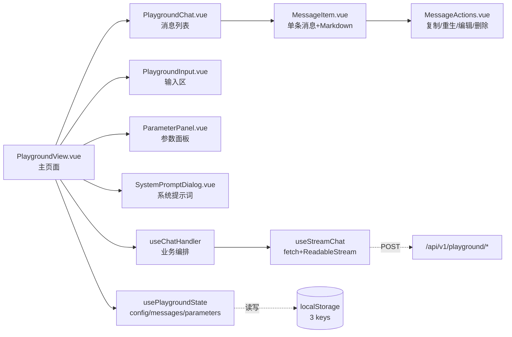
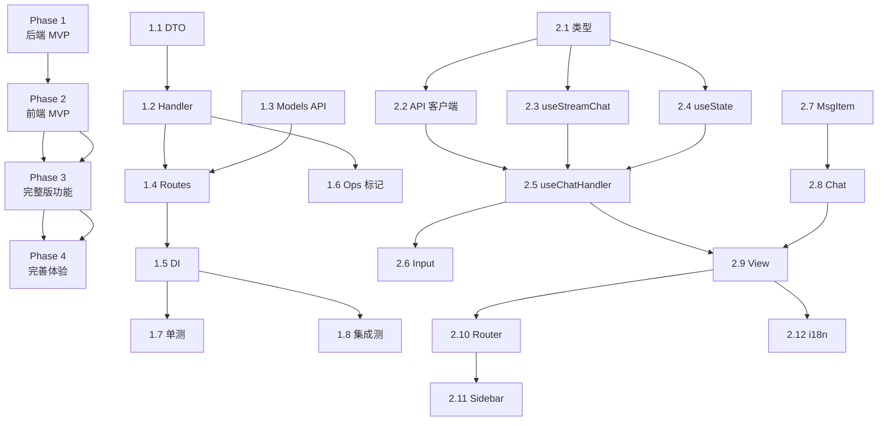

# Sub2API 对话广场（Playground）实施计划

> 创建时间：2026-06-04
> 方法来源：方法丰富（基于深度调研 new-api 操练场 + sub2api 现有能力盘点）
> automation_mode：false（交互模式）

---

## 1. 概述

### 1.1 项目目标

为 sub2api 新增**网页端对话广场（Playground）**功能，让登录用户可以：
- 直接在网页选择自己有权限的分组
- 在分组下选择可用模型
- 进行流式对话交互
- 正常按用户余额扣费、记账、走预警链路

**核心价值**：把现有 AI 网关能力从「外部 API 调用」延伸到「内置网页聊天」，提升产品完整度与用户体验。

### 1.2 背景

sub2api 当前定位 AI 网关，用户必须使用外部工具（Cherry Studio、Postman、自研脚本等）调用 `/v1/chat/completions` 才能体验上游模型。对标项目 new-api 的「操练场」(Playground) 提供了网页内置聊天体验，已成为同类产品的事实标配。

**关键基础**：经过深度调研确认，sub2api 后端 90% 能力（chat completions 转发 / 计费 / 限流 / 记账 / 多协议路由）已完整就绪，移植本质是**前端新建聊天界面 + 后端薄薄一层 JWT 鉴权适配**，无需重写网关核心。

### 1.3 范围

**在范围内 (In-Scope)**：
- ✅ 后端：新增 JWT 鉴权的 `/api/v1/playground/chat/completions` 端点
- ✅ 后端：新增 `/api/v1/playground/models` 用户可用模型聚合端点
- ✅ 后端：虚拟 APIKey 注入适配层（复用现有计费/限流/记账链路）
- ✅ 前端：Vue 3 完整对话广场页面（流式 + Markdown + 系统提示词 + 参数面板）
- ✅ 前端：消息复制 / 重生 / 编辑 / 删除 / 多版本切换
- ✅ 前端：配置导入导出 + 流式中断重连 + 移动端适配 + 暗黑模式
- ✅ 用户侧边栏入口 + Vue Router 路由
- ✅ i18n 三语文案（zh / en / ja）
- ✅ 单元测试（后端 ≥85% / 关键前端 composable）+ 集成测试

**不在范围内 (Out-of-Scope)**：
- ❌ 多模态（图片上传 / 文档上传 / 音频）— 首版仅纯文本
- ❌ 历史对话云端同步（仅 localStorage 本地持久化）
- ❌ Prompt 模板市场 / 角色扮演卡片
- ❌ Function Calling / Tool Use 可视化
- ❌ 实时协作 / 多人共享对话
- ❌ 管理员端「playground 用量统计」专属看板（用现有用量页面即可）

---

## 2. 需求分析

### 2.1 功能需求

| ID | 需求描述 | 优先级 | 备注 |
|----|---------|--------|------|
| FR-001 | 用户登录后访问 `/playground` 路由打开对话广场 | P0 | 入口在用户侧边栏 |
| FR-002 | 用户可下拉选择自己有权限的分组（来自 `/api/v1/groups/available`） | P0 | 含分组费率描述 |
| FR-003 | 用户可下拉选择当前分组下的可用模型 | P0 | 切换分组时模型列表自动刷新 |
| FR-004 | 用户在输入框发送消息，AI 流式返回回复 | P0 | SSE 协议 |
| FR-005 | 用户可中途点击「停止」按钮终止生成 | P0 | AbortController |
| FR-006 | AI 回复支持 Markdown 渲染（代码块高亮 / 数学公式 / 表格） | P0 | 复用 marked + dompurify |
| FR-007 | AI 回复的 `reasoning_content` 可折叠显示（思考链） | P1 | 解析 `<think>` 标签 + delta.reasoning_content |
| FR-008 | 历史消息自动持久化到 localStorage | P0 | 刷新页面不丢失 |
| FR-009 | 用户可复制 / 重生 / 编辑 / 删除单条消息 | P1 | 鼠标悬停显示操作按钮 |
| FR-010 | Regenerate 后保留旧版本，可左右切换查看历史回答 | P1 | message.versions[] 数组 |
| FR-011 | 用户可设置系统提示词（System Prompt） | P1 | 独立对话框，按对话保存 |
| FR-012 | 用户可调整参数（temperature / top_p / max_tokens / frequency_penalty / presence_penalty / seed） | P1 | 双轨制：值 + 启用开关 |
| FR-013 | 用户可导出 / 导入对话配置（JSON 文件） | P2 | file-saver 已存在 |
| FR-014 | 流式中断后用户可手动「继续生成」（不丢上下文） | P2 | 复用 Regenerate 逻辑 |
| FR-015 | 移动端响应式布局 | P2 | Tailwind 断点 |
| FR-016 | 支持暗黑模式（跟随系统/sub2api 全局设置） | P1 | 复用现有暗黑变量 |
| FR-017 | 错误信息友好提示（余额不足 / 分组无权限 / 模型不可用） | P0 | 复用 sub2api 错误码映射 |
| FR-018 | 用户可一键「清空对话历史」 | P1 | 含二次确认 |

### 2.2 非功能需求

| ID | 需求描述 | 指标 | 备注 |
|----|---------|------|------|
| NFR-001 | 计费正确性 | 与 `/v1/chat/completions` 100% 一致 | 走 billingCacheService 同一通道 |
| NFR-002 | 流式首 token 延迟 | P95 < 2s | 取决于上游响应；本地处理 < 50ms |
| NFR-003 | 前端首屏加载 | 路由懒加载，按需打包 | 不增加 dashboard 首屏体积 |
| NFR-004 | 安全性：GroupID 越权 | 严格校验属于用户可用分组 | 参考 new-api `GroupInUserUsableGroups` |
| NFR-005 | 安全性：Markdown XSS | DOMPurify 净化所有渲染内容 | sub2api 已有依赖 |
| NFR-006 | 测试覆盖率 | 后端 ≥85%；前端关键 composable ≥85% | Go testing + Vitest |
| NFR-007 | localStorage 配额 | 单 key < 4MB；超阈值时提示用户清理 | 自动截断超长历史 |
| NFR-008 | 兼容性 | Chrome / Firefox / Safari 最新两版；iOS Safari 15+ | fetch + ReadableStream 兼容性 |
| NFR-009 | 国际化 | 全部文案走 vue-i18n，三语完整 | zh / en / ja |
| NFR-010 | 审计可追溯 | 用量日志标记 `source=playground` | OpsService 记录 |

---

## 3. 技术方案

### 3.1 技术选型

| 层级 | 技术/框架 | 版本 | 理由 |
|------|-----------|------|------|
| 后端语言 | Go | 1.25.7 | 现有技术栈 |
| 后端框架 | Gin | 既有版本 | 现有技术栈 |
| 后端 ORM | ent | 既有版本 | 现有技术栈 |
| 前端框架 | Vue 3 | 3.4+ | 现有技术栈 |
| 前端语言 | TypeScript | ~5.6 | 现有技术栈 |
| 状态管理 | Composition API + ref + localStorage | — | 单页内状态，无需引入 Pinia store |
| HTTP 客户端 | axios | ^1.16 | 现有技术栈（普通请求） |
| **SSE 客户端** | **fetch + ReadableStream**（原生） | — | **零新增依赖**，VC酱无需引入 sse.js |
| Markdown 渲染 | marked + dompurify | 既有 | 现有技术栈 |
| UI 框架 | TailwindCSS | 3.4 | 现有技术栈 |
| 国际化 | vue-i18n | 9.14 | 现有技术栈 |

### 3.2 后端架构设计

```mermaid
flowchart TD
    Browser[浏览器<br/>用户点击发送]
    Browser -->|"POST /api/v1/playground/chat/completions<br/>Bearer JWT"| JwtMW[jwtAuth 中间件<br/>解析 JWT → subject{UserID}]

    JwtMW --> PgHandler[PlaygroundHandler.ChatCompletions]

    PgHandler --> Validate{1. 校验 group<br/>属于用户可用分组?}
    Validate -->|否| Reject[403 Forbidden]
    Validate -->|是| BuildKey[2. 构造虚拟 APIKey<br/>UserID/GroupID/Source=playground]

    BuildKey --> InjectCtx[3. 注入 ctx]
    InjectCtx --> PlatformRoute{4. 按 groupPlatform 路由}

    PlatformRoute -->|Anthropic| AnthHandler["h.Gateway.ChatCompletions<br/>复用现有 OpenAI→Anthropic 转换"]
    PlatformRoute -->|OpenAI| OAIHandler["h.OpenAIGateway.ChatCompletions<br/>复用现有 OpenAI 直通"]

    AnthHandler --> BillingCheck["billingCacheService.<br/>CheckBillingEligibility"]
    OAIHandler --> BillingCheck

    BillingCheck -->|余额不足| Reject402[402 Payment Required]
    BillingCheck -->|通过| Upstream[转发上游<br/>SSE 流式回传]

    Upstream --> RecordUsage["submitUsageRecordTask<br/>异步入库 + 扣余额"]
    RecordUsage --> BalanceNotify["BalanceNotifyService<br/>低余额预警"]
    Upstream -.SSE.-> Browser
```

### 3.3 前端架构设计



### 3.4 关键设计决策

| 决策点 | 选择 | 理由 | 备选方案 |
|--------|------|------|----------|
| 后端鉴权适配 | **虚拟 APIKey 注入**（方案 A） | 改动最小；100% 复用现有计费/限流/记账链路；与 new-api `tempToken` 思路对仗 | 抽取 service 层（方案 B，改动面大） |
| 前端 SSE 实现 | **fetch + ReadableStream** | 零新增依赖；现代浏览器原生支持；AbortController 内置中断 | sse.js（new-api 用，第三方依赖） |
| 状态管理 | Composition API + localStorage | 单页面状态无需 Pinia；与 new-api hooks 设计对仗 | Pinia store（杀鸡用牛刀） |
| 消息持久化 | 三 key 分治 localStorage | 与 new-api 一致；config/messages/parameters 独立读写 | 单 key（容易膨胀 + 难做局部更新） |
| 多版本设计 | `message.versions[]` 数组 | 为 Regenerate 切换留接口；首版仅用 `versions[0]` | 单 content 字段（无法切换历史） |
| 参数面板 | 双轨制（值 + 启用开关） | 禁用参数不发出 = 上游用默认值；与 new-api 一致 | 单值（无法表达"不指定"） |
| reasoning 渲染 | 解析 `<think>` 标签 + delta.reasoning_content 两路汇入 | 兼容 R1 类模型（标签）与 Anthropic 类（独立字段） | 仅一路（漏掉一类模型） |
| 路由命名 | `/playground` | 与 i18n key 一致；国际化友好 | `/chat`（太泛） / `/operating`（太学术） |
| 入口位置 | 用户侧边栏（与 API Keys 并列） | 所有登录用户可用；与 new-api 一致 | 顶部 nav / 浮动按钮 |
| 错误码本地化 | 复用 sub2api 现有错误码映射 | 用户体验一致 | 独立 playground 错误码（重复工作） |

### 3.5 关键 API 契约

#### `POST /api/v1/playground/chat/completions`

**请求**：
```json
{
  "model": "claude-sonnet-4-20250514",
  "group": "pro",
  "messages": [
    {"role": "system", "content": "You are a helpful assistant"},
    {"role": "user", "content": "hello"}
  ],
  "stream": true,
  "temperature": 0.7,
  "top_p": 1,
  "max_tokens": 4096,
  "frequency_penalty": 0,
  "presence_penalty": 0,
  "seed": null
}
```

**响应（流式 SSE）**：
```
data: {"choices":[{"delta":{"role":"assistant"}}]}
data: {"choices":[{"delta":{"content":"Hi"}}]}
data: {"choices":[{"delta":{"content":"! How"}}]}
data: [DONE]
```

**错误响应**：
```json
{
  "error": {
    "type": "authentication_error|invalid_request_error|insufficient_quota",
    "code": "string",
    "message": "本地化错误描述"
  }
}
```

#### `GET /api/v1/playground/models?group=pro`

**响应**：
```json
{
  "code": 0,
  "data": [
    {"id": "claude-sonnet-4-20250514", "platform": "anthropic"},
    {"id": "gpt-4o", "platform": "openai"}
  ]
}
```

---

## 4. 任务分解

### 4.1 任务列表

#### Phase 1：后端 MVP（预估 1.5 天）

- [ ] **任务 1.1**：新增 `PlaygroundRequest` DTO + 验证逻辑
  - 预估工时：1 小时
  - 相关文件：`backend/internal/handler/dto/playground_dto.go`（新建）
  - 备注：包含 `model` / `group` / OpenAI 标准字段

- [ ] **任务 1.2**：新增 `PlaygroundHandler` 与虚拟 APIKey 注入逻辑
  - 预估工时：3 小时
  - 相关文件：`backend/internal/handler/playground_handler.go`（新建，~150 行）
  - 验收：调用 `h.OpenAIGateway.ChatCompletions` / `h.Gateway.ChatCompletions` 时 ctx 含合法虚拟 APIKey

- [ ] **任务 1.3**：新增 `Playground.AvailableModels` 端点
  - 预估工时：1.5 小时
  - 相关文件：`backend/internal/handler/playground_handler.go`
  - 备注：按 group 查询 `h.Gateway.Models` 逻辑聚合返回

- [ ] **任务 1.4**：新增 `RegisterPlaygroundRoutes` + 接入 router.go
  - 预估工时：1 小时
  - 相关文件：
    - `backend/internal/server/routes/playground.go`（新建）
    - `backend/internal/server/router.go`（修改 ~3 行）
  - 验收：`POST /api/v1/playground/chat/completions` + `GET /api/v1/playground/models` 通过 jwtAuth 鉴权

- [ ] **任务 1.5**：扩展 Handlers 结构体注入 PlaygroundHandler
  - 预估工时：0.5 小时
  - 相关文件：`backend/internal/handler/handler.go`（或等价位置）+ DI 容器

- [ ] **任务 1.6**：OpsService 用量日志增加 `source=playground` 标记
  - 预估工时：1 小时
  - 相关文件：`backend/internal/service/ops_service.go`（小幅修改）

- [ ] **任务 1.7**：单元测试：handler + group 越权校验 + 虚拟 APIKey 构造
  - 预估工时：3 小时
  - 相关文件：`backend/internal/handler/playground_handler_test.go`（新建）
  - 验收：覆盖率 ≥85%；含正面/负面/边界用例

- [ ] **任务 1.8**：集成测试：完整 JWT → 转发 → 计费链路
  - 预估工时：2 小时
  - 相关文件：`backend/internal/server/routes/playground_integration_test.go`（新建）
  - 验收：与 `/v1/chat/completions` 行为一致；扣费链路正确

#### Phase 2：前端 MVP（预估 2.5 天）

- [ ] **任务 2.1**：定义 TypeScript 类型 + 常量
  - 预估工时：1 小时
  - 相关文件：
    - `frontend/src/types/playground.ts`（新建，~120 行）
    - `frontend/src/constants/playground.ts`（新建）

- [ ] **任务 2.2**：API 客户端 `playground.ts`
  - 预估工时：1 小时
  - 相关文件：`frontend/src/api/playground.ts`（新建）
  - 包含：`getAvailableModels` / `getAvailableGroups`（复用 `userGroupsAPI.getAvailable`）

- [ ] **任务 2.3**：`useStreamChat` composable（SSE 核心）
  - 预估工时：3 小时
  - 相关文件：`frontend/src/composables/playground/useStreamChat.ts`（新建，~150 行）
  - 验收：支持 fetch + ReadableStream + AbortController；正确解析 SSE 协议（含跨 chunk 截断）；Vitest 单测覆盖

- [ ] **任务 2.4**：`usePlaygroundState` composable（localStorage 持久化）
  - 预估工时：2 小时
  - 相关文件：`frontend/src/composables/playground/usePlaygroundState.ts`（新建，~130 行）
  - 验收：三 key 分治；配额溢出友好降级

- [ ] **任务 2.5**：`useChatHandler` composable（业务编排）
  - 预估工时：2.5 小时
  - 相关文件：`frontend/src/composables/playground/useChatHandler.ts`（新建，~180 行）
  - 备注：参数构造 + 流式状态机 + 错误处理

- [ ] **任务 2.6**：`PlaygroundInput.vue` 输入组件
  - 预估工时：2 小时
  - 相关文件：`frontend/src/components/playground/PlaygroundInput.vue`（新建）
  - 备注：自动高度 textarea + Shift+Enter 换行 + 模型/分组下拉

- [ ] **任务 2.7**：`MessageItem.vue` + Markdown 渲染
  - 预估工时：2.5 小时
  - 相关文件：`frontend/src/components/playground/MessageItem.vue`（新建）
  - 备注：marked + dompurify + 代码块高亮（复用现有 marked 配置）

- [ ] **任务 2.8**：`PlaygroundChat.vue` 消息列表 + 自动滚动
  - 预估工时：1.5 小时
  - 相关文件：`frontend/src/components/playground/PlaygroundChat.vue`（新建）

- [ ] **任务 2.9**：`PlaygroundView.vue` 主页面装配
  - 预估工时：2 小时
  - 相关文件：`frontend/src/views/user/PlaygroundView.vue`（新建）

- [ ] **任务 2.10**：路由 `/playground` 注册 + Auth Guard
  - 预估工时：0.5 小时
  - 相关文件：`frontend/src/router/index.ts`（修改 ~10 行）

- [ ] **任务 2.11**：用户侧边栏入口
  - 预估工时：0.5 小时
  - 相关文件：`frontend/src/components/layout/`（修改对应布局组件）

- [ ] **任务 2.12**：i18n 文案三语
  - 预估工时：1.5 小时
  - 相关文件：`frontend/src/i18n/locales/{zh,en,ja}.json`（新增 `playground.*` 命名空间）

#### Phase 3：完整版功能（预估 2.5 天）

- [ ] **任务 3.1**：`MessageActions.vue`（复制/重生/编辑/删除）
  - 预估工时：2.5 小时
  - 相关文件：`frontend/src/components/playground/MessageActions.vue`（新建）

- [ ] **任务 3.2**：消息多版本切换（regenerate 保留旧版本）
  - 预估工时：2 小时
  - 相关文件：`MessageItem.vue` + `useChatHandler.ts`（扩展 `versions[]` 逻辑）

- [ ] **任务 3.3**：`SystemPromptDialog.vue` 系统提示词
  - 预估工时：1.5 小时
  - 相关文件：`frontend/src/components/playground/SystemPromptDialog.vue`（新建）

- [ ] **任务 3.4**：`ParameterPanel.vue` 参数面板（双轨制）
  - 预估工时：3 小时
  - 相关文件：`frontend/src/components/playground/ParameterPanel.vue`（新建）
  - 备注：温度/top_p/max_tokens/frequency_penalty/presence_penalty/seed + 启用开关

- [ ] **任务 3.5**：reasoning_content 折叠显示 + `<think>` 解析
  - 预估工时：2 小时
  - 相关文件：`MessageItem.vue` + 新增 `lib/think-tag-parser.ts`

- [ ] **任务 3.6**：配置导入/导出（JSON）
  - 预估工时：1.5 小时
  - 相关文件：`PlaygroundView.vue` + `usePlaygroundState.ts`（扩展）

- [ ] **任务 3.7**：流式中断后「继续生成」
  - 预估工时：1.5 小时
  - 相关文件：`useChatHandler.ts`（扩展）

- [ ] **任务 3.8**：composable 单元测试（Vitest）
  - 预估工时：3 小时
  - 相关文件：`frontend/src/composables/playground/__tests__/*.spec.ts`
  - 验收：覆盖率 ≥85%

#### Phase 4：完善体验（预估 1 天）

- [ ] **任务 4.1**：移动端响应式适配（Tailwind 断点）
  - 预估工时：2 小时
  - 相关文件：各 playground 组件

- [ ] **任务 4.2**：暗黑模式适配
  - 预估工时：1.5 小时
  - 相关文件：各 playground 组件 + tailwind dark: 类名

- [ ] **任务 4.3**：错误码本地化映射
  - 预估工时：1.5 小时
  - 相关文件：`api/playground.ts` + i18n 文案

- [ ] **任务 4.4**：用量提示组件（剩余余额/本次预计成本预估，可选）
  - 预估工时：1.5 小时
  - 相关文件：`PlaygroundView.vue`（小幅扩展）

- [ ] **任务 4.5**：清空对话历史（含二次确认）
  - 预估工时：0.5 小时
  - 相关文件：`PlaygroundView.vue` + `usePlaygroundState.ts`

- [ ] **任务 4.6**：长对话 localStorage 配额检查 + 友好降级
  - 预估工时：1 小时
  - 相关文件：`usePlaygroundState.ts`（扩展）

- [ ] **任务 4.7**：CHANGELOG.md 更新
  - 预估工时：0.5 小时
  - 相关文件：`CHANGELOG.md`

- [ ] **任务 4.8**：PROJECTWIKI.md 更新（如存在）/ 新增功能说明
  - 预估工时：0.5 小时
  - 相关文件：`PROJECTWIKI.md` 或 `docs/`

### 4.2 依赖关系



---

## 5. 里程碑

| 阶段 | 里程碑名称 | 完成标志 | 预计时间 |
|------|-----------|---------|---------|
| M1 | 后端 API 就绪 | `curl -H 'Authorization: Bearer JWT' POST /api/v1/playground/chat/completions` 返回流式响应；用量正确入库；单测覆盖 ≥85% | 1.5 天 |
| M2 | 前端 MVP 可用 | 用户登录后访问 `/playground` 能完成完整对话流程（流式/Markdown/模型分组切换/历史持久化） | 2.5 天 |
| M3 | 完整版功能 | 消息操作 / 多版本 / 参数面板 / reasoning / 配置导入导出全部完成；前端单测覆盖 ≥85% | 2.5 天 |
| M4 | 体验完善 + 文档 | 移动端 / 暗黑模式 / 错误本地化全部到位；CHANGELOG / PROJECTWIKI 更新 | 1 天 |

**总预估时间：7.5 个工作日**

---

## 6. 风险与约束

### 6.1 风险清单

| ID | 风险描述 | 可能性 | 影响 | 缓解措施 |
|----|---------|--------|------|----------|
| R-001 | 虚拟 APIKey 注入逻辑遗漏中间件链路导致计费失效 | 中 | 🔴 高 | 集成测试强制覆盖完整链路；与 `/v1/chat/completions` 行为对比；用真实测试账号验证扣费 |
| R-002 | GroupID 越权切换（用户改 body group 字段访问无权分组） | 高 | 🔴 高 | 复用 `userGroupsAPI.getAvailable` 严格校验；单测覆盖越权场景 |
| R-003 | fetch SSE 在 401 时无自动 Token 刷新（axios 拦截器不生效） | 高 | 🟡 中 | 401 时主动跳转登录页；前端展示明确提示「请重新登录」 |
| R-004 | Anthropic 平台不支持某些 OpenAI 参数（如 `seed`）导致请求失败 | 中 | 🟡 中 | 前端按 `groupPlatform` 动态禁用不支持的参数；后端透传 unknown 字段交给上游 |
| R-005 | 长对话 localStorage 超过 5MB 浏览器配额 | 中 | 🟢 低 | 每次存储前检查；超阈值时引导用户清理；提供「仅保留最近 N 轮」选项 |
| R-006 | Markdown 渲染 XSS 风险（恶意输出包含 script） | 低 | 🔴 高 | DOMPurify 严格净化；禁用 `unsafe-html` 配置 |
| R-007 | reasoning_content 流式状态机错误导致 UI 抖动 | 中 | 🟢 低 | 单测覆盖 `<think>` 标签跨 chunk 截断场景；状态机三态严格管理 |
| R-008 | 修改 sub2api 路由注册时引入回归（破坏现有 `/v1/chat/completions`） | 低 | 🔴 高 | 修改 router.go 时仅追加，不调整既有顺序；集成测试覆盖既有 chat completions |
| R-009 | 移动端键盘弹起遮挡输入框 | 中 | 🟢 低 | 使用 `100dvh` + `safe-area-inset` + 输入框 `scrollIntoView` |
| R-010 | 流式响应过快导致 React-like 渲染抖动（Vue 3 是 ref，但仍要注意） | 低 | 🟢 低 | 用 `shallowRef` + 节流批量更新 |

### 6.2 约束条件

- **技术约束**：
  - 必须使用 sub2api 现有技术栈（Vue 3 / Gin / ent），不引入新框架
  - SSE 必须用零依赖方案（fetch + ReadableStream），不引入 sse.js
  - 不破坏 `/v1/chat/completions` 现有路由
  - 不修改 billingCacheService / submitUsageRecordTask 核心逻辑
- **时间约束**：
  - 总预估 7.5 工作日（含测试）
  - 可拆分多次 PR 提交（每个 Phase 一次）
- **资源约束**：
  - 工作目录：`/mnt/d/All_Project/连接yun/sub2api`
  - 当前分支：`main`
  - 工作区保留 1 个未提交的测试改动（`subscription_renew_usage_reset_test.go`，不动）
- **流程约束**：
  - 不主动执行 git commit / push（仅 VC酱明确要求时）
  - 每个 Phase 完成后调用 `/zen-review` 代码审查
  - 关键改动写入 CHANGELOG.md

---

## 7. 验收标准

### 7.1 质量指标

| 指标 | 目标值 | 最低值 | 验证方式 |
|------|--------|--------|----------|
| 后端测试覆盖率 | 85% | 70% | `go test -coverprofile` |
| 前端关键 composable 覆盖率 | 85% | 70% | Vitest |
| 后端 handler 圈复杂度 | ≤10 | ≤15 | gocyclo |
| 前端组件复杂度 | ≤10 | ≤15 | eslint-plugin-vue/complexity |
| P95 流式首 token 延迟（本地处理） | ≤50ms | ≤200ms | 集成测试计时 |
| 既有 `/v1/chat/completions` 回归 | 100% 通过 | 必须通过 | 现有测试不变 |

### 7.2 验收清单

#### 后端
- [ ] `POST /api/v1/playground/chat/completions` 通过 JWT 鉴权可正常调用
- [ ] 流式响应符合 SSE 协议（`data: ...\n\n` + `[DONE]`）
- [ ] 用户余额扣减与 `/v1/chat/completions` 一致
- [ ] 用量日志正确入库且标记 `source=playground`
- [ ] GroupID 越权返回 403
- [ ] 余额不足返回 402 + 明确错误码
- [ ] 模型不在用户可用列表返回 403
- [ ] 所有单测通过且覆盖率 ≥85%
- [ ] 集成测试覆盖完整 JWT → 转发 → 扣费链路
- [ ] 既有 `/v1/chat/completions` 回归测试全部通过

#### 前端
- [ ] 用户登录后侧边栏可见「对话广场」入口
- [ ] 访问 `/playground` 正常加载页面
- [ ] 分组下拉显示用户可用分组（与 `/api/v1/groups/available` 一致）
- [ ] 切换分组时模型列表自动刷新
- [ ] 输入消息后能正常流式接收并 Markdown 渲染
- [ ] 「停止生成」按钮能立即中断流式响应
- [ ] reasoning_content 正确折叠显示（含 `<think>` 标签解析）
- [ ] 刷新页面后历史消息恢复
- [ ] 复制 / 重生 / 编辑 / 删除消息功能正常
- [ ] Regenerate 后可左右切换查看历史版本
- [ ] 系统提示词可设置且生效
- [ ] 参数面板的双轨制（值 + 开关）正常工作
- [ ] 配置导入导出可用
- [ ] 移动端布局正常无遮挡
- [ ] 暗黑模式渲染正确
- [ ] 余额不足等错误提示本地化正确
- [ ] 三语 i18n 完整无缺失 key
- [ ] composable 单测覆盖率 ≥85%

#### 文档
- [ ] CHANGELOG.md 新增对话广场条目
- [ ] PROJECTWIKI.md 或 docs/ 含功能说明
- [ ] plan.md 所有任务勾选完成

---

## 8. 评审记录

> 本章节在执行完成后补充

### 8.1 变更记录

| 日期 | 变更内容 | 原因 | 影响 |
|------|---------|------|------|

### 8.2 执行摘要

[执行完成后，添加整体执行情况的 2-3 句话摘要]
