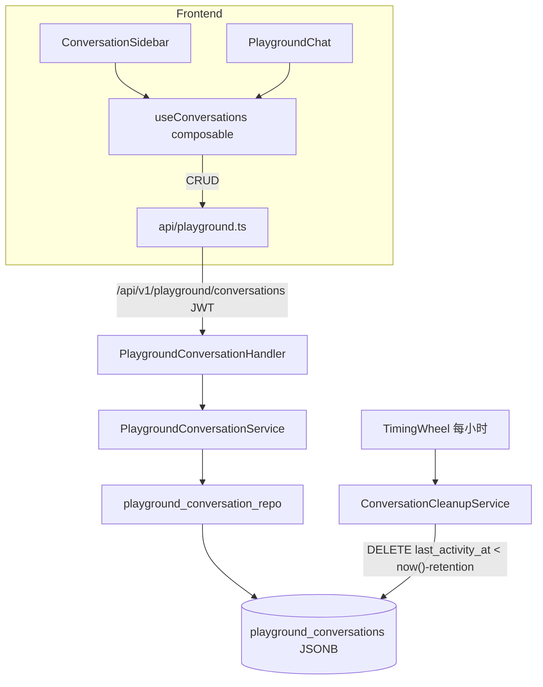
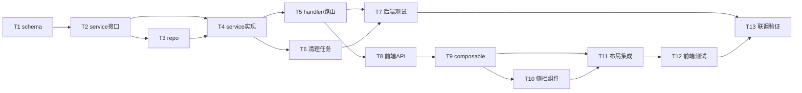

# 对话广场多会话持久化 实施计划

> 创建时间：2026-06-11
> 方法来源：方法澄清（存储方案经用户确认为服务器数据库）
> automation_mode：false（交互模式）

---

## 1. 概述

### 1.1 项目目标

为 sub2api「对话广场」实现**多会话 + 服务端持久化**：

- 左侧会话列表侧栏：新建对话、切换对话、删除对话、当前对话高亮
- 对话记录存 PostgreSQL（ent ORM），跨设备同步
- 超过 **3 天**（可配置）未活动的会话由后台定时任务自动清理

### 1.2 背景

当前对话广场为单会话模式，消息存浏览器 localStorage（单 key、上限 200 条），无法多会话并行、无法跨设备、清缓存即丢失。用户参考竞品（左侧会话栏 + 新建按钮）提出改造需求，并确认采用服务器数据库方案。

### 1.3 范围

- **In-Scope**：
  - 新表 `playground_conversations` 及三层（repository/service/handler）CRUD
  - 会话过期清理定时任务（TimingWheel，保留天数可配置，默认 3 天）
  - 前端会话侧栏组件、状态管理改造（localStorage → 服务端 API）、i18n
  - 旧 localStorage 单会话数据一次性迁移导入
- **Out-of-Scope**：
  - 会话分享/导出链接、会话搜索、消息级独立存储（消息整体存 JSONB）
  - 管理端会话浏览/审计界面
  - chat/completions 转发链路改动（保持现状，保存动作由前端触发）

---

## 2. 需求分析

### 2.1 功能需求

| ID | 需求描述 | 优先级 | 备注 |
|----|---------|--------|------|
| FR-001 | 会话 CRUD API（列表/详情/新建/更新/删除），JWT 鉴权 | P0 | 列表不返回 messages 大字段 |
| FR-002 | 左侧会话栏：列表、新建、删除、当前高亮、可折叠 | P0 | 参考竞品布局 |
| FR-003 | 消息持久化：流式回复结束后防抖保存全量 messages | P0 | PUT 全量覆盖，简单可靠 |
| FR-004 | 会话标题：取首条用户消息前 20 字，支持手动改名 | P1 | |
| FR-005 | 过期清理：last_activity_at 超过保留期自动删除 | P0 | 默认 3 天，每小时跑批 |
| FR-006 | 旧 localStorage 消息迁移为一个新会话 | P2 | 仅首次加载时尝试 |

### 2.2 非功能需求

| ID | 需求描述 | 指标 | 备注 |
|----|---------|------|------|
| NFR-001 | 越权防护 | 所有操作强校验 user_id = JWT subject | repository 层 Where 双保险 |
| NFR-002 | 防滥用 | 单用户会话数上限 50；单会话 messages ≤ 50MB | 超限返回 400 |
| NFR-003 | 列表性能 | 列表查询 P95 ≤ 200ms | (user_id, last_activity_at) 复合索引 |
| NFR-004 | 测试覆盖率 | ≥ 85%（最低 70%） | service + repo 关键路径 |

---

## 3. 技术方案

### 3.1 技术选型

| 层级 | 技术/框架 | 理由 |
|------|-----------|------|
| 存储 | PostgreSQL JSONB（messages 整体存储） | 复用 account.credentials 既有惯例，避免消息级表的复杂度 |
| ORM | ent（make generate） | 项目既有 |
| 调度 | TimingWheelService.ScheduleRecurring | 复用 usage_cleanup_service 模式 |
| 前端 | Vue3 composable + 防抖保存 | 沿用 usePlaygroundState 架构 |

### 3.2 架构设计

### 3.3 关键设计决策

| 决策点 | 选择 | 理由 | 备选方案 |
|--------|------|------|----------|
| 消息存储粒度 | 会话级 JSONB 整存（含 versions/attachments，后端不解析） | 前端结构复杂多变，后端透明存储最稳 | 消息级独立表（过度设计） |
| 保存时机 | 前端流结束后防抖 PUT 全量 | 不侵入网关转发链路 | 网关侧拦截保存（耦合重） |
| 清理策略 | 物理删除，每小时批量 | 体验数据无审计价值 | 软删除（无必要） |
| 保留期配置 | config `playground.conversation_retention_days`（默认 3） | 后续可调 | 硬编码 72h |

---

## 4. 任务分解

### 4.1 任务列表

#### M1 后端（T1-T6）

- [x] **T1**: 定义 ent schema `playground_conversation` 并生成代码
  - 预估工时：1 小时
  - 相关文件：`backend/ent/schema/playground_conversation.go`
  - 备注：字段 user_id/title/model/group_name/messages(jsonb, json.RawMessage)/last_activity_at；TimeMixin；索引 (user_id, last_activity_at)、(last_activity_at)；`make generate`

- [x] **T2**: service 层接口与类型定义
  - 预估工时：1.5 小时
  - 相关文件：`backend/internal/service/playground_conversation.go`
  - 备注：PlaygroundConversation 结构、Repository 接口（List/GetByID/Create/Update/Delete/DeleteExpired/CountByUser）、错误定义
  - 完成摘要：已创建 PlaygroundConversation/PlaygroundConversationSummary 结构、PlaygroundConversationRepository 接口（7 个方法）、3 个错误变量、2 个常量；go build/vet 通过

- [x] **T3**: repository 实现 + wire 注册
  - 预估工时：1.5 小时
  - 相关文件：`backend/internal/repository/playground_conversation_repo.go`、`backend/internal/repository/wire.go`
  - 备注：参考 announcement_repo；List 不取 messages 字段（Select 排除）；所有查询带 user_id 条件
  - 完成摘要：已实现全部 7 个方法；DeleteExpired 采用 Select IDs + IDIn 两步批量删除；ProviderSet 已注册 NewPlaygroundConversationRepository；wire_gen.go 暂未修改（无消费方，T4 完成后补充）；go build/vet 通过

- [x] **T4**: service 业务实现（含上限/越权校验）
  - 预估工时：2 小时
  - 相关文件：`backend/internal/service/playground_conversation_service.go`、`backend/internal/service/wire.go`
  - 备注：会话数上限 50、messages ≤ 50MB 校验、Update 时刷新 last_activity_at；注意路由 body limit 需放宽至 50MB
  - 完成摘要：新建 PlaygroundConversationService（List/Get/Create/Update/Delete），Create 校验会话数上限（CountByUser）和 messages 体积；Update 先 GetByID 再局部改写再 repo.Update；ProviderSet 已注册 NewPlaygroundConversationService；go build/vet（service/repository/server 包）通过

- [x] **T5**: handler + DTO + 路由注册
  - 预估工时：2 小时
  - 相关文件：`backend/internal/handler/playground_conversation_handler.go`（新建）、`backend/internal/handler/dto/playground.go`（扩展）、`backend/internal/server/routes/playground.go`、`backend/internal/handler/handler.go`、`backend/internal/handler/wire.go`、`backend/cmd/server/wire_gen.go`
  - 备注：GET/POST `/playground/conversations`、GET/PUT/DELETE `/playground/conversations/:id`
  - 完成摘要：新建 PlaygroundConversationHandler（5 个方法）；DTO 新增 Summary/Detail/Create/Update 结构及 FromService mapper；路由在 /conversations 子组注册 5 条路由，body limit 52MB；handler.go Handlers 新增字段；wire.go ProvideHandlers 加参数；wire_gen.go 手动追加 repo/service/handler 实例化；go build 通过

- [x] **T6**: 过期清理服务 + 配置项
  - 预估工时：1.5 小时
  - 相关文件：`backend/internal/service/playground_conversation_cleanup.go`、`backend/internal/config/config.go`、`backend/internal/service/wire.go`、`backend/cmd/server/wire_gen.go`
  - 备注：参考 usage_cleanup_service；每小时执行；`conversation_retention_days` 默认 3，0 = 禁用清理
  - 完成摘要：新建 PlaygroundConversationCleanupService（Start/Stop/runOnce，单次最多 100 批、5 分钟超时）；config 新增 PlaygroundConfig + PlaygroundCleanupConfig（3 个配置项 + setDefaults）；wire.go 加 ProvidePlaygroundConversationCleanupService 并注入 ProviderSet；wire_gen.go 手动追加实例化及 provideCleanup 生命周期挂载；go build/vet 通过

- [x] **T7**: 后端单元测试 ✅ 完成
  - 完成时间：2026-06-11
  - 相关文件：`backend/internal/service/playground_conversation_service_test.go`、`backend/internal/repository/playground_conversation_repo_test.go`
  - 执行摘要：repo 层 6 个用例（sqlite 内存库：CRUD/越权/倒序/过期边界=恰好截止点不删/batchSize 分批）+ service 层 8 个用例（stub repo：会话数上限/50MB 体积/255 rune 截断/部分更新语义钉死 model nil=清空）全部通过

#### M2 前端（T8-T12）

- [x] **T8**: API client 与类型定义
  - 预估工时：1 小时
  - 相关文件：`frontend/src/api/playground.ts`、`frontend/src/types/playground.ts`、`frontend/src/constants/playground.ts`
  - 备注：conversations CRUD 五个方法 + Conversation/ConversationSummary 类型
  - 执行摘要：types/api/constants 三件套：Conversation 类型对齐后端 DTO（含 model/group_name 清空语义警示注释）、CRUD 五方法、防抖/标题常量

- [x] **T9**: 会话状态 composable（核心改造）
  - 预估工时：3 小时
  - 相关文件：`frontend/src/composables/playground/useConversations.ts`（新建）、`frontend/src/composables/playground/usePlaygroundState.ts`
  - 备注：列表加载/切换（懒加载详情）/新建/删除/改名；流结束后防抖 1s 保存；localStorage 旧数据一次性迁移；MESSAGES 不再写 localStorage
  - 执行摘要：useConversations composable：列表/切换(flush先行)/草稿态新建/删除/改名/防抖1s保存链(串行化)/localStorage 迁移/beforeunload flush；usePlaygroundState 移除 messages 持久化

- [x] **T10**: ConversationSidebar 组件
  - 预估工时：2 小时
  - 相关文件：`frontend/src/components/playground/ConversationSidebar.vue`（新建）
  - 备注：会话卡片（标题+相对时间）、+新建按钮、悬浮删除、当前高亮、移动端可折叠
  - 执行摘要：ConversationSidebar：标题+新建按钮+保留期提示+骨架/空态+会话卡片(相对时间/悬浮删除/激活高亮)

- [x] **T11**: PlaygroundView 布局集成 + i18n
  - 预估工时：2 小时
  - 相关文件：`frontend/src/views/user/PlaygroundView.vue`、`frontend/src/i18n/locales/zh.ts`、`frontend/src/i18n/locales/en.ts`
  - 备注：左栏(w-64 可折叠) + 右侧聊天区；沿用 fullHeight flex 链路；空态「开始一个新对话」
  - 执行摘要：PlaygroundView 集成：左栏(md+显示) + playground-main 列；isGenerating 下降沿触发保存；编辑/删除/清空消息同步保存；i18n zh/en 各10条

- [x] **T12**: 前端测试 + typecheck
  - 预估工时：1.5 小时
  - 相关文件：`frontend/src/composables/playground/__tests__/useConversations.spec.ts`
  - 备注：vitest 覆盖切换/防抖保存/迁移逻辑；vue-tsc 零错误
  - 执行摘要：vitest 10 用例全过（迁移/切换/草稿创建/防抖合并/PUT必带model+group/删除回草稿/切换前flush）；vue-tsc 零错误

#### M3 验证（T13）

- [ ] **T13**: 联调验证 + 代码审查 + 文档
  - 预估工时：2 小时
  - 相关文件：`CHANGELOG.md`、`PROJECTWIKI.md`（如存在）
  - 备注：本地起前后端联调全流程；reviewer-code 双轮验证；更新文档

### 4.2 依赖关系

---

## 5. 里程碑

| 阶段 | 里程碑名称 | 完成标志 | 预计时间 |
|------|-----------|---------|---------|
| M1 | 后端 API 就绪 | conversations CRUD 可 curl 通过 + 清理任务注册 + 单测绿 | ~12h |
| M2 | 前端多会话可用 | 侧栏新建/切换/删除全流程可用，typecheck 零错误 | ~9.5h |
| M3 | 验证交付 | 联调通过 + reviewer-code 无 P0/P1 问题 + 文档更新 | ~2h |

**预估总工时：约 23.5 小时**

---

## 6. 风险与约束

### 6.1 风险清单

| ID | 风险描述 | 可能性 | 影响 | 缓解措施 |
|----|---------|--------|------|----------|
| R-001 | messages JSONB 体积膨胀拖慢列表查询 | 中 | 中 | 列表查询 Select 排除 messages；50MB 上限 |
| R-002 | 防抖保存窗口内关页面丢最后一轮消息 | 中 | 低 | beforeunload 时同步 flush 一次 |
| R-003 | ent generate 产物与现有 atlas 迁移流程冲突 | 低 | 高 | T1 完成后先在本地库验证迁移再继续 |
| R-004 | 用户清理预期差异（3天指"未活动"非"创建"） | 低 | 低 | UI 侧栏标注「会话保留 3 天」提示 |

### 6.2 约束条件

- **技术约束**：每个子任务 ≤200 行、≤5 文件；遵循 announcement 三层惯例；注释中文（与代码库一致）
- **安全约束**：所有 API 强校验归属；不在日志输出消息内容
- **流程约束**：完成后必须 reviewer-code 双轮验证；不主动 git commit

---

## 7. 验收标准

### 7.1 质量指标

| 指标 | 目标值 | 最低值 | 验证方式 |
|------|--------|--------|----------|
| 测试覆盖率（新增代码） | 85% | 70% | go test -cover / vitest |
| 列表 API P95 | ≤200ms | ≤500ms | 联调观测 |
| vue-tsc / go build | 零错误 | 零错误 | CI 本地跑 |

### 7.2 验收清单

- [ ] 新建/切换/删除/改名/高亮全流程可用，刷新与跨设备数据一致
- [ ] 越权访问他人会话返回 404/403
- [ ] 清理任务删除超过保留期会话（手动改 last_activity_at 验证）
- [ ] 旧 localStorage 数据成功迁移为一个会话
- [ ] 测试覆盖率达标
- [ ] 代码审查通过（reviewer-code）
- [ ] 文档更新完成（CHANGELOG.md）

---

## 8. 评审记录

> 本章节在执行完成后补充

### 8.1 变更记录

| 日期 | 变更内容 | 原因 | 影响 |
|------|---------|------|------|

### 8.2 执行摘要

（待补充）
