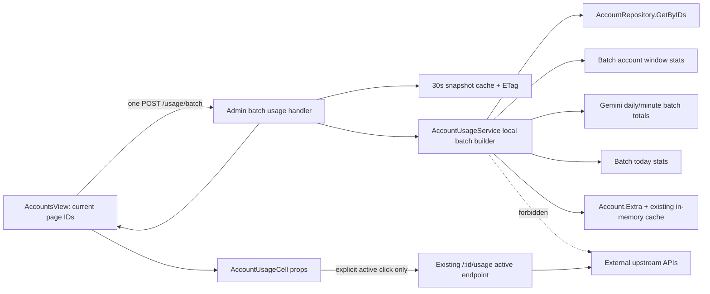
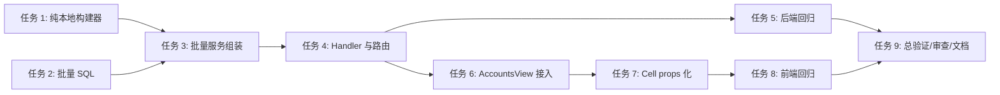

# 账号用量批量快照实施计划

> 创建时间：2026-07-16
> 方法来源：方法澄清（用户确认采用“批量聚合用量”）
> automation_mode：false（交互模式）

---

## 1. 概述

### 1.1 项目目标

为后台账号管理页增加“当前页用量批量快照”能力，将 50 个账号渲染时最多 50 次 `GET /admin/accounts/:id/usage` 收敛为 1 次批量请求。批量路径仅读取 PostgreSQL、`Account.Extra` 被动快照和已有内存缓存，不得访问任何外部上游。

### 1.2 背景

`AccountUsageCell.vue` 在桌面端 mount 时立即调用单账号 usage API，`usageLoadQueue.ts` 实际不限并发。单账号服务会重复 `GetByID` 和统计查询，部分平台还会在快照过期时发起 15-30 秒的上游探测。当总账号量超过 1,000 且每页显示 50 条时，HTTP、数据库和外部连接会同时放大，导致页面长时间卡顿。

### 1.3 范围

- **在范围内 (In-Scope)**：
  - 新增最多 100 个账号 ID 的批量本地 usage snapshot API。
  - 批量加载账号、今日统计、滚动窗口统计和 Gemini 日/分钟聚合数据。
  - 账号页统一拉取 usage 与 today stats，并通过 props 传入 `AccountUsageCell`。
  - 保留单账号 active/force 上游刷新，仅用户明确点击时触发。
  - 请求取消/序列防竞态、短 TTL 快照缓存、ETag 和手动本地刷新兼容。
- **不在范围内 (Out-of-Scope)**：
  - 全量 1,000+ 账号的后台健康巡检、任务队列或持久化健康快照系统。
  - 改变现有单账号 `/usage` API 语义或删除 today-stats 兼容接口。
  - 账号列表排序索引、分页 COUNT 或调度分计算的独立优化。

---

## 2. 需求分析

### 2.1 功能需求

| ID | 需求描述 | 优先级 | 备注 |
|----|---------|--------|------|
| FR-001 | 新增 `POST /api/v1/admin/accounts/usage/batch` | P0 | `account_ids` 缺失/非正数/超过 100 返回 400；空数组返回空映射；重复 ID 去重 |
| FR-002 | 响应按 `account_id` 映射 usage、today stats 与单账号降级信息 | P0 | 单个 ID 缺失/不支持/快照缺失不得使整批失败 |
| FR-003 | 批量服务使用 `AccountRepository.GetByIDs` | P0 | 禁止对每个 ID 调用 `GetByID` |
| FR-004 | 批量统计优先复用 `GetAccountWindowStatsBatch`、`GetGeminiUsageTotalsBatch` 和 today batch | P0 | 不可使用 `Promise.all`/并发单账号 API 伪装批量 |
| FR-005 | 各平台只构建被动语义 | P0 | Anthropic=Extra+local window；OpenAI=Codex Extra+local window；Gemini=local quota/statistics；Grok=Extra snapshot+today；Antigravity=已有 cache-only，miss 降级 |
| FR-006 | 账号页每次当前页加载只发送 1 次 batch usage 请求 | P0 | 同一响应供 usage 列和 today stats 列使用 |
| FR-007 | `AccountUsageCell` 不再 mount 自动请求 | P0 | 消费父组件 props；单账号 active 按钮仍调原 API |
| FR-008 | 翻页、筛选、排序和刷新忽略过期响应 | P0 | `AbortController` + request sequence + 当前 ID 集合校验 |

### 2.2 非功能需求

| ID | 需求描述 | 指标 | 备注 |
|----|---------|------|------|
| NFR-001 | 页面请求数 | 50/100 个 ID 均为 1 次 usage HTTP | 不计用户点击单账号 active 刷新 |
| NFR-002 | 批量接口性能 | 本地快照命中时 P95 ≤ 200ms | 上限 100 ID，需记录 SQL/HTTP 调用次数 |
| NFR-003 | 网络隔离 | 批量路径 0 次上游 HTTP | 用 fake fetcher 计数器或 panic stub 验证 |
| NFR-004 | 容错 | 部分缺失仍返回 HTTP 200 | 结构性输入错误除外 |
| NFR-005 | 安全 | 响应不含 credentials/原始 Extra | 仅序列化 `UsageInfo` 允许字段与显式错误码 |
| NFR-006 | 质量 | 测试覆盖率目标 85%，不得低于 70% | Go test + Vitest coverage，平均圈复杂度 ≤ 10 |

---

## 3. 技术方案

### 3.1 技术选型

| 层级 | 技术/框架 | 版本 | 理由 |
|------|-----------|------|------|
| 前端 | Vue 3 + TypeScript + Axios | 仓库现有版本 | 复用 `AccountsView` 已有 batch today stats 和 request sequence 模式 |
| 后端 | Go + Gin | 仓库 `go.mod` | 保持 handler/service/repository 分层和现有路由结构 |
| 数据 | PostgreSQL + Ent/SQL | PostgreSQL 15+ | 通过 `ANY($1)` / `GROUP BY account_id` 实现真正批量聚合 |
| 缓存 | 现有 `snapshotCache` + ETag | 30s 短 TTL | 复用已有 today stats 缓存约定，不引入新基础设施 |
| 测试 | Go testing + Vitest | 仓库现有版本 | 覆盖服务隔离、handler 合约和 Vue 竞态 |

### 3.2 架构设计



### 3.3 API 合约

```json
POST /api/v1/admin/accounts/usage/batch
{
  "account_ids": [101, 102, 103]
}

{
  "usage": {
    "101": { "source": "passive", "five_hour": null },
    "102": null
  },
  "today_stats": {
    "101": { "requests": 12, "tokens": 3400, "cost": 0.2, "standard_cost": 0.25, "user_cost": 0.2 }
  },
  "errors": {
    "102": { "code": "snapshot_unavailable", "message": "local snapshot unavailable" }
  }
}
```

- 请求字段缺失、非正数 ID 或去重后超过 100：HTTP 400。
- `account_ids: []`：HTTP 200，三个 map 均为空。
- 账号不存在、平台不支持或本地快照不存在：HTTP 200，该 ID 进入 `errors`，其他 ID 正常返回。
- handler 可对规范化后的 ID 集合使用 30 秒快照缓存与 ETag；显式页面手动刷新可绕过 handler 缓存，但仍严格禁止上游请求。

### 3.4 关键设计决策

| 决策点 | 选择 | 理由 | 备选方案 |
|--------|------|------|----------|
| 页面请求形态 | usage + today stats 合并为一个 batch snapshot | 满足“当前页只发一次用量请求”，且可复用 Grok local usage | 保留两个 batch API 会额外产生一次 HTTP |
| 账号加载 | `GetByIDs` 一次加载 | 消除 N+1 repository 查询 | 并发 `GetByID` 仍是 N 次 SQL |
| 滚动窗口 | 同起点复用 `GetAccountWindowStatsBatch`，变起点增加每 ID start-time 批量 SQL | Anthropic/OpenAI 窗口起点可能不同，不能用最早时间估算 | 逐账号查询会重新引入 N+1 |
| Antigravity | 只读 `UsageCache.antigravityCache`，miss 返回降级 | 现有数据没有可靠的 Extra 持久化快照，不允许 batch 调 fetcher | 未来可单独增加持久化快照任务 |
| 单账号错误 | 批次 200 + `errors` map | 保证部分可用数据可渲染 | 遇一个错误整批 500 |
| 竞态控制 | AbortController + sequence + ID fingerprint | Axios cancel 与逻辑丢弃双保险 | 仅 sequence 不会主动释放连接 |

---

## 4. 任务分解

### 4.1 任务列表

> 每个任务控制在 ≤200 行业务改动、≤5 个文件；执行时逐项勾选并补充摘要。

- [x] **任务 1**: 定义批量被动 usage 服务合约与平台纯本地构建器
  - 预估工时：3 小时
  - 相关文件：`backend/internal/service/account_usage_service.go`、`backend/internal/service/account_usage_service_test.go`
  - 备注：抽取 Anthropic/OpenAI/Grok 的 Extra 构建逻辑；Antigravity 只读 cache；所有返回值标记 passive/degraded。
  - 完成摘要：新增 `account_usage_batch.go`，平台构建仅消费 `Account.Extra`、Gemini 本地策略和 Antigravity 内存缓存；缓存对象深拷贝后返回，未调用任何上游 fetcher。

- [x] **任务 2**: 增加滚动窗口与 Gemini 所需的批量 repository 查询
  - 预估工时：3 小时
  - 相关文件：`backend/internal/repository/usage_log_repo_stats.go`、`backend/internal/repository/usage_log_repo_stats_integration_test.go`、`backend/internal/service/account_usage_service.go`
  - 备注：复用现有 same-start/today batch；变起点窗口使用单次 SQL 按 account_id 聚合；禁止默认回退 N+1。
  - 完成摘要：新增 `GetAccountWindowStatsByStartBatch`，通过 `unnest` 将同账号 5h/7d 等不同起点在单条 SQL 聚合；today 和 Gemini 均强制使用既有 batch reader，不允许 N+1 回退。

- [x] **任务 3**: 组装 `GetUsageBatchPassive` 并实现部分失败降级
  - 预估工时：4 小时
  - 相关文件：`backend/internal/service/account_usage_service.go`、`backend/internal/service/account_usage_service_test.go`、`backend/internal/service/gemini_quota.go`
  - 备注：一次 `GetByIDs`，按平台分组，一次今日统计、Gemini 日/分钟聚合，缺失账号进 `errors`。
  - 完成摘要：批量服务一次 `GetByIDs`，常数级 today/window/Gemini 查询；不存在、不支持和快照缺失按账号写入 `errors`，其余账号继续成功返回。

- [x] **任务 4**: 新增 admin batch handler、路由、输入限制与快照缓存
  - 预估工时：3 小时
  - 相关文件：`backend/internal/handler/admin/account_handler.go`、`backend/internal/handler/admin/account_usage_batch_cache.go`、`backend/internal/server/routes/admin.go`、`backend/internal/handler/admin/account_handler_usage_batch_test.go`
  - 备注：100 ID 上限、严格正数验证、去重、空数组、ETag/304、手动本地刷新 bypass。
  - 完成摘要：新增 `POST /api/v1/admin/accounts/usage/batch`；严格校验字段、正数和去重后 100 上限，空数组成功；支持 30 秒缓存、ETag/304 及 `refresh=true` 本地刷新绕过。

- [x] **任务 5**: 补齐后端隔离、批量和性能回归测试
  - 预估工时：3 小时
  - 相关文件：`backend/internal/service/account_usage_service_test.go`、`backend/internal/handler/admin/account_handler_usage_batch_test.go`、`backend/internal/repository/usage_log_repo_stats_integration_test.go`
  - 备注：覆盖 50/100 ID、重复 ID、部分缺失、不支持平台、fetcher 零调用、SQL 调用数不随 N 线性增长。
  - 完成摘要：新增 service/handler/repository 聚焦测试，覆盖 50/100 ID 常数级调用、fetcher panic 隔离、重复/非法/超限/空输入、部分失败、缓存/304 和单 SQL 多窗口；相关四个 Go 包全量测试通过。

- [x] **任务 6**: 增加前端 batch usage API client 并将 `AccountsView` 切换为单请求快照
  - 预估工时：3 小时
  - 相关文件：`frontend/src/api/admin/accounts.ts`、`frontend/src/types/index.ts`、`frontend/src/views/admin/AccountsView.vue`
  - 备注：一个响应同时填充 usage/today maps；翻页、筛选、排序时 abort；过期 sequence/ID fingerprint 响应丢弃。
  - 完成摘要：新增固定 batch 合约与 API client；`AccountsView` 使用单次页面级请求同时填充 usage/today maps，并以 AbortController、递增序号和 ID fingerprint 丢弃过期响应。

- [x] **任务 7**: 将 `AccountUsageCell` 改为消费父组件快照并保留单账号 active 刷新
  - 预估工时：3 小时
  - 相关文件：`frontend/src/components/account/AccountUsageCell.vue`、`frontend/src/utils/usageLoadQueue.ts`、`frontend/src/components/account/__tests__/AccountUsageCell.spec.ts`
  - 备注：移除 mount/manual-token 逐行自动请求与模块缓存依赖；仅 active 按钮调用原单账号 API。
  - 完成摘要：单元格改为纯消费父级 snapshot/loading/error props，移除 mount、行变化和表格刷新触发的逐行请求及无效 queue；明确 active 点击仍调用单账号强制刷新。

- [x] **任务 8**: 增加 `AccountsView` Vitest 竞态与 O(1) 请求数验证
  - 预估工时：3 小时
  - 相关文件：`frontend/src/views/admin/__tests__/AccountsView.usageBatch.spec.ts`、`frontend/src/components/account/__tests__/AccountUsageCell.spec.ts`、`frontend/src/api/admin/accounts.ts`
  - 备注：覆盖 50/100 行只调 1 次 batch、旧响应不覆盖新页、abort、部分缺失渲染、active 点击仅调 1 次。
  - 完成摘要：新增 50/100 行单请求、翻页 abort 与迟到响应、部分错误降级、手动 `refresh=true` 单请求测试；Cell 测试固化 snapshot props、单账号 active 请求及原有展示场景。最新聚焦 2 文件 19 测试、typecheck、ESLint 均通过。

- [ ] **任务 9**: 执行集成验证、reviewer-code 双轮审查并同步文档
  - 预估工时：4 小时
  - 相关文件：`PROJECTWIKI.md`、`CHANGELOG.md`、`plan.md`
  - 备注：`PROJECTWIKI.md` 和 `CHANGELOG.md` 当前均缺失，P3 创建基础增量文档；审查问题修复后第二轮必须无阻塞项。

### 4.2 依赖关系



---

## 5. 里程碑

| 阶段 | 里程碑名称 | 完成标志 | 预计时间 |
|------|-----------|---------|---------|
| M1 | 本地批量服务 | 任务 1-3 完成；一次账号加载和少量批量 SQL；上游 fetcher 零调用 | 1.5 工作日 |
| M2 | API 合约可用 | 任务 4-5 完成；输入校验、部分降级、ETag 与 50/100 ID 测试通过 | 1 工作日 |
| M3 | 前端单请求切换 | 任务 6-8 完成；50 行不再产生逐行 `/usage` | 1 工作日 |
| M4 | 质量闭环 | 任务 9 完成；双轮审查通过，覆盖率/性能达标，文档同步 | 0.5 工作日 |

---

## 6. 风险与约束

### 6.1 风险清单

| ID | 风险描述 | 可能性 | 影响 | 缓解措施 |
|----|---------|--------|------|---------|
| R-001 | 为复刻不同账号窗口起点而回退逐账号 SQL | 中 | 高 | 通过每 ID start-time 批量 SQL 一次聚合，测试断言 repository 调用数 |
| R-002 | “被动”构建器间接调用上游 fetcher | 中 | 高 | 分离纯函数/本地方法，fetcher 使用 panic stub 验证零调用 |
| R-003 | Antigravity cache miss 后信息比现在少 | 高 | 中 | 显式返回 `snapshot_unavailable`，保留单账号 active 按钮，不在页面加载阶段隐式探测 |
| R-004 | 复用共享 cache 指针时重算倒计时引发数据竞态 | 中 | 高 | 返回前克隆 `UsageInfo` 及嵌套可变对象，不原地修改 cache 值 |
| R-005 | 旧页响应在新页响应后覆盖界面 | 中 | 高 | AbortController、单调序号和 ID fingerprint 三层防护 |
| R-006 | 合并 today stats 导致其独立列回归 | 低 | 中 | 保留旧 API，新 batch 响应沿用 `WindowStats` 类型并增加组件测试 |
| R-007 | 30 秒 handler cache 使手动刷新看到旧本地数据 | 中 | 中 | 手动刷新支持 bypass cache，但服务层仍不允许 active fetch |

### 6.2 约束条件

- **技术约束**：保留现有单账号 usage/today-stats API；不引入破坏性 API 变更或新基础设施。
- **安全约束**：批量路径不得序列化 credentials、access token、proxy URL 或原始 Extra。
- **网络约束**：不得调用 ClaudeUsageFetcher、OpenAIQuotaService 上游探测、AntigravityQuotaFetcher.FetchQuota、Grok probe 或任何外部 HTTP client。
- **粒度约束**：每个执行任务 ≤200 行业务代码、≤5 文件，超出时按服务/repository/handler/前端分拆。
- **工作区约束**：保留用户已有改动，不回滚无关文件；旧计划已归档为 `plan_v20260716_164954.md`。
- **流程约束**：`automation_mode=false`，本计划生成后必须由用户确认才能进入 P3。

---

## 7. 验收标准

### 7.1 质量指标

| 指标 | 目标值 | 最低值 | 验证方式 |
|------|--------|--------|----------|
| 后端相关测试覆盖率 | 85% | 70% | `go test -cover` 聚焦 service/handler/repository 包 |
| 前端相关测试覆盖率 | 85% | 70% | `pnpm test:coverage -- AccountsView.usageBatch AccountUsageCell` |
| 平均圈复杂度 | ≤ 10 | ≤ 15 | reviewer-code + lint/static analysis |
| 批量 API P95 | ≤ 200ms | ≤ 500ms | 100 ID 本地快照 benchmark/集成测试 |
| 页面 usage HTTP 请求 | 1 次/50 或 100 行 | 1 次/页 | Vitest API mock 调用次数 |
| 批量路径上游请求 | 0 | 0 | panic/counter fetcher stub |

### 7.2 验收清单

- [ ] `POST /admin/accounts/usage/batch` 正确处理空数组、重复 ID、非正数 ID、100 上限和超限输入。
- [ ] 50/100 个账号只有一次 `GetByIDs`、常数级批量统计查询和零上游请求。
- [ ] Anthropic、OpenAI、Gemini、Grok、Antigravity 的被动字段语义有测试固化，不支持/缺失快照可单 ID 降级。
- [ ] `AccountsView` 当前页只请求一次 batch，`AccountUsageCell` mount 不再自动请求 `/usage`。
- [ ] 翻页/筛选/排序/手动刷新时过期响应不能覆盖当前页数据。
- [ ] 用户明确点击单账号 active 刷新时，原 `/admin/accounts/:id/usage?source=active&force=true` 仍正常工作。
- [ ] 响应中不包含凭证、原始 Extra 或代理敏感信息。
- [ ] Go 聚焦测试、Vitest、TypeScript typecheck 和相关 lint 通过。
- [ ] reviewer-code 双轮审查通过，无 P0/P1 未修复项。
- [ ] `PROJECTWIKI.md`、`CHANGELOG.md` 和本 `plan.md` 的完成状态已同步。

### 7.3 建议验证命令

```bash
cd backend && go test ./internal/service ./internal/handler/admin ./internal/repository
cd frontend && pnpm test:run -- AccountsView.usageBatch AccountUsageCell
cd frontend && pnpm typecheck
cd frontend && pnpm lint:check
```

---

## 8. 评审记录

> 本章节在执行完成后补充。

### 8.1 变更记录

| 日期 | 变更内容 | 原因 | 影响 |
|------|---------|------|------|
| 2026-07-16 | 创建批量用量快照计划 | 用户确认根源优化方向 | 等待用户确认后进入 P3 |

### 8.2 执行摘要

- 前端任务 6-8 已完成：当前页 usage 与 today stats 合并为一次 batch 请求，逐行自动 `/usage` 请求已移除，单账号 active/force 刷新保留。
- 前端验证：最新 usage 聚焦 Vitest 2 个文件共 19 项测试通过（此前相关 6 文件回归亦通过）；`pnpm typecheck` 通过；改动文件 ESLint 通过。
