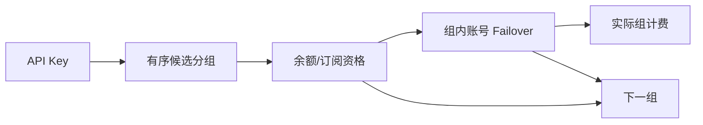

# Design: API Key 有序多分组容灾 (Design)

## 1. Architecture
功能位于 API Key 鉴权和现有账号 failover 之间：鉴权加载有序候选链，先在当前组完成计费资格检查和账号切换，组内安全重试耗尽后再推进下一组。



## 2. Data Model & Interfaces

```typescript
interface ApiKey {
  group_id: number | null
  group_ids: number[]
}
```

`api_key_groups` 保存 `api_key_id`、`group_id` 和 0-4 的 `priority`。`api_keys.group_id` 保留为首组兼容镜像，关联表是顺序真实来源。

创建与更新同时接受新 `group_ids` 和旧 `group_id`：前者优先；只提供旧字段时形成单分组链。

## 3. Data Flow & Interaction
1. 用户从可用分组中多选，拖拽生成严格顺序。
2. 服务端校验数量、去重、同平台和逐组使用权限后事务保存。
3. 请求鉴权加载候选链，并从第一组开始检查余额或订阅资格。
4. 当前组可用时运行原有账号 failover；组内耗尽且错误可安全重试时推进下一组。
5. 成功响应按实际组、订阅和账号写入计费及用量日志。
6. 每个新请求重新从第一组开始，主组恢复后自动回切。

## 4. Error Handling
- **候选配置无效**: 重复、超过 5 个、跨平台或无权限时返回 400/403，不部分保存。
- **计费资格不可用**: 余额不足、无可用订阅、订阅耗尽/过期时跳过当前组。
- **上游可重试故障**: 连接错误、超时、429、5xx 在组内账号耗尽后推进下一组。
- **不可重试错误**: 参数、权限、客户端取消直接返回，不跨组。
- **重放风险**: Writer 已提交或异步任务可能已创建时停止推进。
- **全部耗尽**: 返回最后一个最有信息量的错误，并记录尝试过的分组 ID，不记录敏感凭证。
