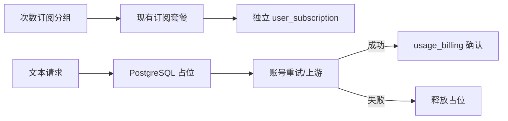

# Design: 纯次数订阅套餐 (Design)

## 1. Architecture
功能扩展现有订阅分组和多订阅消费链路。文本请求在上游调用前为具体订阅创建数据库占位；成功确认加入统一计费事务，失败或安全切组时释放。



## 2. Data Model & Interfaces
- `groups`: `subscription_billing_mode`、`request_limit_5h`、`request_limit_1d`。
- `user_subscriptions`: 两个窗口的起点和占用计数。
- `subscription_request_reservations`: request、API Key、订阅、窗口快照、pending/committed/released 状态和过期时间。

```typescript
interface RequestCountWindow {
  limit: number
  used: number
  remaining: number
  reset_at: string | null
}

interface SubscriptionProgress {
  billing_mode: 'usd' | 'request_count'
  request_5h?: RequestCountWindow
  request_1d?: RequestCountWindow
}
```

## 3. Data Flow & Interaction
1. 管理员创建订阅分组，选择 `request_count` 并配置两个窗口上限，再创建普通套餐绑定分组。
2. 文本 Handler 完成媒体意图识别后，请求订阅服务为当前逻辑 request ID 占位。
3. Repository 事务回收过期 pending、推进窗口、选择最早到期可用订阅并增加占用计数。
4. 同组账号重试复用占位；跨组前释放旧占位，并在新组重新占位。
5. 成功用量结算在 `usage_billing` 事务中确认占位；明确失败幂等释放。
6. 用户订阅进度返回次数已用、剩余和重置时间。

## 4. Error Handling
- **5小时或24小时耗尽**: 尝试下一张订阅和下一候选组；全部耗尽返回 429 和最近重置时间。
- **上游失败**: 校验失败、超时、4xx/5xx 释放占位；重复释放不重复递减。
- **客户端中断**: 上游尚未成功响应时释放；已开始成功响应时确认扣次。
- **进程异常**: pending 到期后由下一次同订阅占位事务回收；窗口重置不会被旧占位误减。
- **重复请求/结算**: `request_id + subscription_id` 唯一，确认加入现有 usage billing 幂等事务。
