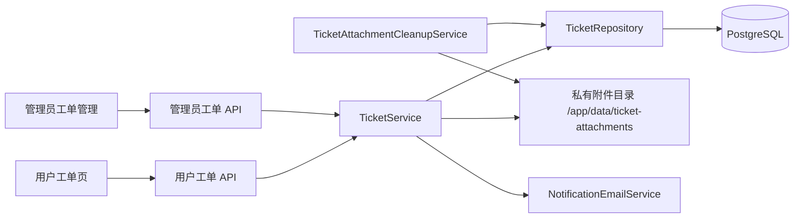

# Design: 站内工单系统 (Design)

## 1. Architecture

工单作为现有单体应用内的新业务模块实现，不引入外部服务或新依赖。

- 用户路由继续使用现有登录鉴权中间件，所有查询由后端强制附加 `user_id`。
- 管理员路由使用现有管理员中间件；管理员都可处理，负责人仅用于协作和邮件收件人选择，不形成独占锁。
- 站内未读复用公告模块的前端 store/角标模式，使用独立的工单未读汇总接口。
- 邮件复用 `NotificationEmailService` 的模板、语言和幂等投递能力；发送失败只记录日志，不回滚已提交的工单操作。

## 2. Data Model & Interfaces

### 2.1 `support_tickets`

| 字段 | 类型 | 说明 |
|------|------|------|
| `id` | BIGSERIAL | 工单编号，界面显示为 `#<id>` |
| `user_id` | BIGINT | 创建用户，所有用户侧查询的权限边界 |
| `subject` | VARCHAR(200) | 标题 |
| `category` | VARCHAR(32) | `account`、`billing`、`api`、`model`、`other` |
| `status` | VARCHAR(24) | `pending_admin`、`pending_user`、`closed` |
| `priority` | VARCHAR(16) | `normal`、`high`、`urgent`，默认 `normal` |
| `assignee_id` | BIGINT NULL | 可选管理员负责人 |
| `closed_by` | BIGINT NULL | 最近一次关闭操作人 |
| `closed_at` | TIMESTAMPTZ NULL | 最近一次关闭时间 |
| `last_message_at` | TIMESTAMPTZ | 列表排序和待处理筛选 |
| `created_at` / `updated_at` | TIMESTAMPTZ | 审计时间 |

主要索引：`(user_id, created_at DESC)`、`(user_id, status)`、`(status, priority, last_message_at DESC)`、`(assignee_id, status)`、`(category, status)`。

### 2.2 `support_ticket_messages`

| 字段 | 类型 | 说明 |
|------|------|------|
| `id` | BIGSERIAL | 单调递增消息 ID，可用于未读游标 |
| `ticket_id` | BIGINT | 所属工单 |
| `author_id` | BIGINT NULL | 用户或管理员；系统事件为空 |
| `kind` | VARCHAR(16) | `public`、`internal`、`system` |
| `visibility` | VARCHAR(16) | `user` 或 `admin` |
| `body` | TEXT | 纯文本正文，写入后不可编辑或删除 |
| `metadata` | JSONB | 状态、负责人、优先级变化的最小审计数据 |
| `created_at` | TIMESTAMPTZ | 发送时间 |

公开回复使用 `kind=public, visibility=user`；内部备注使用 `kind=internal, visibility=admin`。关闭、重开、认领和优先级变化写入不可变的 `system` 消息，用户只看到与其相关的公开状态事件。

### 2.3 `support_ticket_attachments`

| 字段 | 类型 | 说明 |
|------|------|------|
| `id` | BIGSERIAL | 附件 ID |
| `message_id` | BIGINT | 所属消息 |
| `uploader_id` | BIGINT | 上传人 |
| `original_name` | VARCHAR(255) | 仅展示，不能参与磁盘路径拼接 |
| `storage_key` | VARCHAR(255) | 服务端随机生成的相对路径 |
| `media_type` | VARCHAR(100) | 服务端探测后的 MIME |
| `size_bytes` | BIGINT | 文件大小 |
| `delete_after` | TIMESTAMPTZ NULL | 工单关闭时间加 30 天；重开时清空 |
| `deleted_at` | TIMESTAMPTZ NULL | 已物理删除标记，元数据继续保留 |
| `deleted_by` | BIGINT NULL | 管理员手动删除时记录 |
| `delete_reason` | VARCHAR(255) NULL | 自动过期或管理员删除原因 |
| `created_at` | TIMESTAMPTZ | 上传时间 |

允许的文件为 JPG、PNG、WebP、TXT、LOG、JSON。每条消息最多 5 个文件，单文件不超过 5 MB，总计不超过 20 MB。

### 2.4 `support_ticket_reads`

| 字段 | 类型 | 说明 |
|------|------|------|
| `ticket_id` | BIGINT | 工单 |
| `user_id` | BIGINT | 当前查看者，包括管理员 |
| `last_read_message_id` | BIGINT | 当前用户有权查看的最后消息 ID |
| `read_at` | TIMESTAMPTZ | 最近阅读时间 |

`(ticket_id, user_id)` 唯一。用户未读只计算公开消息；管理员未读包含公开消息、内部备注和管理员可见系统事件。

### 2.5 API

用户接口：

| 方法 | 路径 | 用途 |
|------|------|------|
| `GET` | `/api/v1/tickets` | 分页查看自己的工单 |
| `POST` | `/api/v1/tickets` | 以 multipart 创建工单、首条消息和附件 |
| `GET` | `/api/v1/tickets/:id` | 查看自己的工单详情并标记已读 |
| `POST` | `/api/v1/tickets/:id/replies` | 追加公开回复；已关闭时原子重开 |
| `GET` | `/api/v1/tickets/unread-count` | 用户工单未读数 |
| `GET` | `/api/v1/ticket-attachments/:id` | 鉴权下载或预览附件 |

管理员接口：

| 方法 | 路径 | 用途 |
|------|------|------|
| `GET` | `/api/v1/admin/tickets` | 按状态、分类、优先级、负责人和关键词筛选 |
| `GET` | `/api/v1/admin/tickets/:id` | 查看完整对话、内部备注和审计事件 |
| `POST` | `/api/v1/admin/tickets/:id/replies` | 发送公开回复或内部备注 |
| `PATCH` | `/api/v1/admin/tickets/:id` | 修改优先级、负责人或关闭状态 |
| `GET` | `/api/v1/admin/tickets/unread-count` | 当前管理员未读数 |
| `DELETE` | `/api/v1/admin/ticket-attachments/:id` | 删除违规或敏感附件并留痕 |

所有写接口拒绝未知枚举、空正文且无附件的回复，以及越权的工单或附件 ID。列表使用现有分页响应约定。

## 3. Data Flow & Interaction

### 3.1 创建工单
1. 用户提交分类、标题、正文和附件。
2. 服务端验证请求体、文件数量、文件大小、扩展名、探测 MIME 和文件内容。
3. 在数据库事务中锁定当前用户行，检查“未关闭不超过 5 个、当天创建不超过 10 个”。
4. 创建 `pending_admin/normal` 工单、首条公开消息、附件元数据和创建者已读游标。
5. 文件以随机存储键写入私有目录；任一步失败时清理本次临时文件和数据库写入。
6. 提交成功后通知全部状态正常的管理员；邮件失败不影响创建结果。

### 3.2 双向回复和状态流转
1. 用户回复公开消息：`pending_user` 或 `closed` 原子切换为 `pending_admin`；关闭工单同时清空 `closed_at/closed_by` 和未删除附件的 `delete_after`。
2. 管理员公开回复：状态切换为 `pending_user` 并邮件通知工单用户。
3. 管理员内部备注：状态不变、仅管理员可见、不通知用户。
4. 管理员关闭：状态切换为 `closed`，写入关闭事件，并将现存附件的 `delete_after` 设置为关闭时间加 30 天。
5. 所有消息和状态操作追加不可变记录；客户端成功后刷新详情、列表和未读角标。

### 3.3 负责人和通知
1. 未认领工单的新建/用户回复邮件发送给全部正常管理员。
2. 已认领工单的用户回复仅发送给负责人；其他管理员仍通过站内未读看到变化。
3. 负责人被禁用、删除或取消分配时，自动回退为通知全部正常管理员。
4. 更换负责人写入管理员可见系统事件，并通知新负责人一次。
5. 邮件只包含摘要和站内链接，不接收入站邮件，也不允许邮件直接回复工单。

### 3.4 附件清理
1. 后台清理服务按固定间隔分批锁定 `delete_after <= now AND deleted_at IS NULL` 的附件。
2. 先删除私有文件，再原子记录 `deleted_at/delete_reason`；文件不存在视为幂等成功。
3. 清理失败记录错误并在下一轮重试，不删除工单、消息或附件元数据。
4. 管理员手动删除使用同一删除逻辑，并追加管理员可见系统事件。

## 4. Error Handling
- **越权访问**: 对非本人用户统一返回 `404`，避免泄露工单或附件是否存在；管理员接口仍由服务端验证管理员身份。
- **创建限流**: 超过 5 个未关闭工单返回 `TICKET_OPEN_LIMIT_REACHED`；当天超过 10 个返回 `TICKET_DAILY_LIMIT_REACHED`。用户行锁保证并发创建不能绕过限制。
- **附件不合法**: 数量、大小、总量、扩展名、MIME 或内容校验失败时整条消息不创建，并清理临时文件。
- **存储失败**: 返回可重试错误，不留下可见的空消息；后台定期清理无数据库引用的临时文件。
- **邮件失败**: 工单操作保持成功，记录不含正文和附件的结构化错误日志；站内未读仍正常工作。
- **并发回复/关闭**: 事务锁定工单行，按提交顺序追加消息和更新状态，不覆盖消息。
- **负责人失效**: 读取时将失效负责人视为未分配，通知回退全部正常管理员，并允许管理员重新认领。
- **清理重试**: 文件删除和数据库标记均为幂等；单个附件失败不阻断同批其他附件。

## 5. Security & Operations
- 正文按纯文本存储和转义渲染，不执行 Markdown HTML，避免存储型 XSS。
- 文件名只用于展示；磁盘路径仅使用服务端随机键，并校验最终路径始终位于附件根目录内。
- 图片需通过解码头校验；文本必须为 UTF-8 且不含 NUL；JSON 文件还需通过 JSON 语法校验。
- 私有目录权限为 `0700`、文件为 `0600`，不通过 nginx 暴露；下载必须经过后端鉴权并设置 `X-Content-Type-Options: nosniff`。
- 日志、邮件和错误响应不得包含附件内容、正文、用户邮箱明文或存储路径。
- 部署前备份数据库和 `/app/data`；数据库迁移只新增表与索引，不修改现有业务表语义。

## 6. UI Structure
- 用户侧新增 `/tickets`：可扫描的工单列表、状态/分类标签、新建工单页和线程详情；仅在详情底部提供回复与附件控件。
- 管理员侧新增 `/admin/tickets`：桌面使用紧凑表格和筛选工具栏，移动端使用分行列表；详情展示公开对话、内部备注、负责人、优先级和关闭操作。
- 用户与管理员侧边栏均显示工单入口和稳定尺寸的未读角标；登录后加载一次，并在页面可见时每 60 秒刷新。
- 所有上传、回复、认领和关闭操作具有加载、成功、失败和重复提交禁用状态；键盘焦点、标签和错误信息满足现有可访问性约定。
