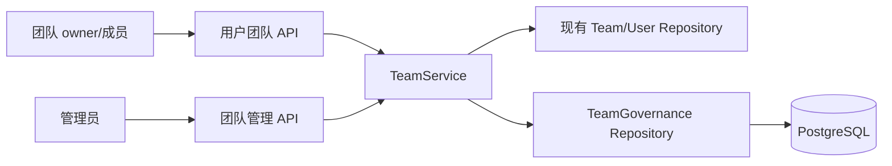

# Design: 团队治理与资金防滥用 (Design)

## 1. Architecture
团队治理作为现有 TeamService 旁的持久化能力，由同一服务执行业务校验。用户与管理员 Handler 复用该服务，新增表通过顺序 SQL migration 和原生 `database/sql` 仓储访问，避免修改并重新生成 Ent。



## 2. Data Model & Interfaces
- `teams` 新增 `member_limit`、`level`、`review_required`，现有团队回填为当前成员数与既有上限孰大，并标记待复审。
- `team_applications` 保存 `create/expand` 申请、目标人数、理由、补充说明、审核结果、豁免与管理员审计信息。
- `team_join_requests` 保存邀请码加入申请及 owner 审核结果。
- `team_governance_settings` 使用单行配置保存创建门槛和 5/15/40 各档条件及 AND/OR 逻辑。
- `team_transferable_balances` 保存用户当前可转赠额度；migration 上线时按用户现有余额初始化。
- `team_fund_ledger` 保存存入、分配和直接转赠流水，并标记资金来源是否可再次转赠。

```typescript
interface TeamGovernanceSettings {
  min_registration_days: number
  min_total_recharge: number
  levels: Array<{ limit: 5 | 15 | 40; recharge: number; spend_7d: number; mode: 'and' | 'or' }>
}
```

## 3. Data Flow & Interaction
1. 用户提交创建申请；服务按注册时间、真实支付和已使用余额兑换码校验门槛。
2. 管理员批准后在事务中创建团队并绑定 owner；不满足门槛时仅允许填写豁免原因后批准。
3. 用户输入邀请码只创建待审批加入申请；owner 批准时锁定团队并校验人数上限。
4. owner 点击升级，系统汇总团队有效充值和近 7 天 `actual_cost`，直接升级到满足条件的最高档。
5. 超过 40 人创建扩容申请；管理员可调整目标人数后批准，或直接修改单团队上限。
6. 余额存入或转赠时原子扣减可转赠额度；团队分配到账只增加余额，不增加可转赠额度。

## 4. Error Handling
- **重复申请**: 同一用户或团队同类型只允许一个 pending 申请，返回 409。
- **并发超员**: owner 批准加入时锁定团队记录并重新统计成员，已满返回 409。
- **条件未满足**: 创建/升级返回结构化的当前值与门槛，不产生部分状态。
- **冻结团队**: 禁止刷新邀请码、提交/批准加入、转赠、存入、分配和扩容，读操作保留。
- **余额不足**: 同时校验用户总余额与可转赠额度，任一不足都不扣款。
- **兼容数据**: 现有团队保留成员关系和余额，`review_required=true` 时禁止 owner 自助升级。
