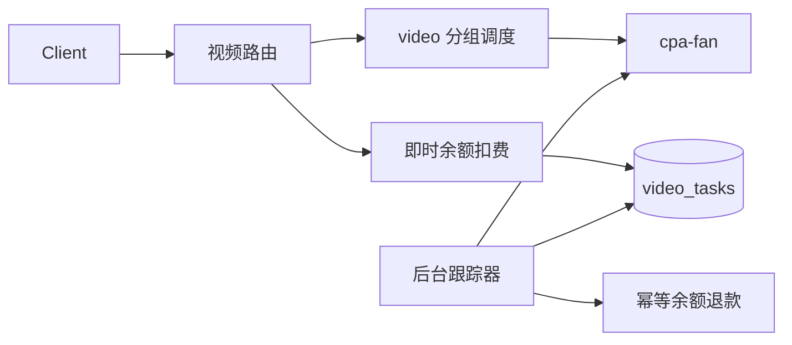

# Design: 独立视频平台与失败退款 (Design)

## 1. Architecture

## 2. Data Model & Interfaces
- `groups.video_billing_mode`: `per_second` 或 `per_request`。
- `video_tasks`: 上游任务 ID、账号/API Key/用户、退款金额、状态、轮询时间、退款时间和错误摘要。
- 任务创建记录与首次余额扣费在同一数据库事务中提交。

## 3. Data Flow & Interaction
1. 管理员创建 `video` 平台 API Key 账号并绑定同平台分组。
2. 客户端调用视频创建、生成、编辑或延长接口。
3. 网关调度账号、透传请求、即时计费并持久化任务。
4. 后台按任务 ID 查询上游；成功标记完成，失败原额退回余额。
5. 客户端查询接口继续透传上游结果。

## 4. Error Handling
- 上游创建失败不计费、不创建任务。
- 查询网络错误延后重试，不立即退款。
- 明确失败状态触发数据库事务退款；状态条件和唯一约束防止重复退款。
- 未知或非终态状态按指数退避继续查询，不推断失败、不退款。
